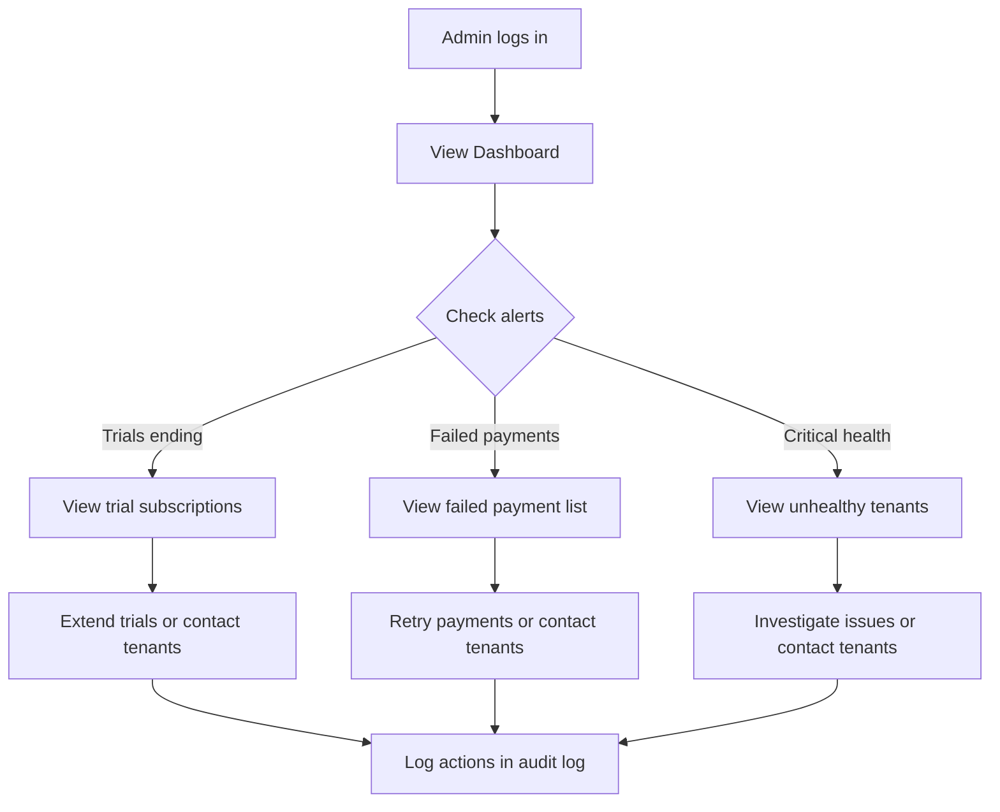
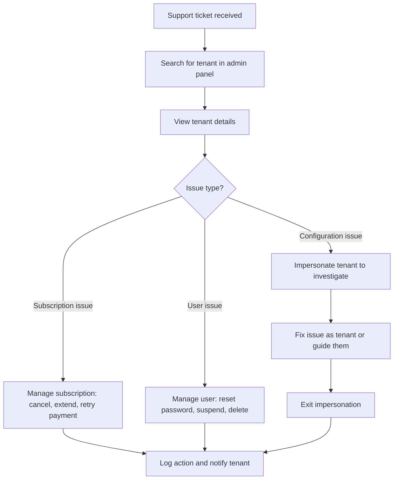
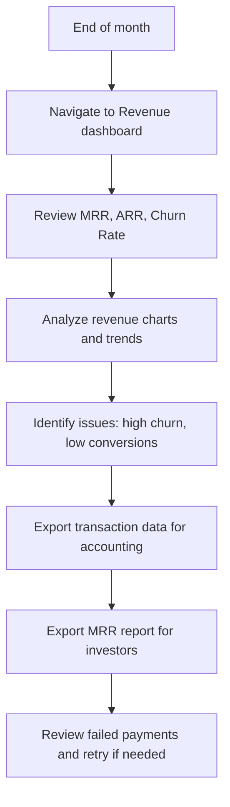

# Admin Panel / Platform Management System - PRD

**Created**: 2026-01-25
**Status**: Draft
**Owner**: Product Manager
**Target Release**: Q2 2026
**Document Type**: Core Feature Requirements
**Dependencies**: Subscription Pricing System (2026-01-subscription-pricing-system.md)

---

## 1. Goal

Implement a comprehensive admin panel that enables platform owners (super admins) to manage the entire Termio SaaS platform - from tenant management and subscription oversight to revenue analytics and platform health monitoring. The system must provide complete visibility and control over all aspects of the multi-tenant booking platform.

### Success Criteria

- **Operational efficiency**: Admins can manage any tenant issue in under 5 clicks
- **Platform visibility**: Real-time dashboard shows MRR, ARR, active tenants, health metrics
- **Revenue transparency**: Complete financial reporting with exportable data
- **Audit trail**: 100% of admin actions logged for compliance and security
- **Fast access**: All admin operations complete in under 2 seconds

---

## 2. Target Audience

### Primary Users

**Platform Owners (Super Admins)**
- Profile: Termio SaaS business owners, technical co-founders
- Current state: Limited admin capabilities, manual database queries
- Need: Complete platform oversight, financial reporting, tenant management
- Technical skill: High (comfortable with admin tools)
- Expected usage: Daily monitoring, on-demand interventions

**Customer Success Managers**
- Profile: Support team members helping tenants
- Current state: Cannot view tenant details or assist with issues
- Need: Read-only access to tenant data, ability to extend trials
- Technical skill: Medium (understands SaaS concepts)
- Expected usage: Multiple times daily for support tickets

### Use Cases

1. **Monitor platform health**: Check MRR growth, active subscriptions, failed payments
2. **Manage troubled tenants**: Suspend abusive accounts, extend trials for good prospects
3. **Financial reporting**: Export revenue data for accounting, calculate churn rates
4. **Subscription interventions**: Cancel subscriptions, process refunds, extend trials
5. **User support**: Reset passwords, investigate user issues, impersonate tenants
6. **Platform settings**: Configure Stripe, manage feature flags, set global limits

---

## 3. Problem

### Current State

- No admin interface exists (frontend has mock data, backend has only Plan controller)
- Platform metrics invisible (cannot see MRR, ARR, churn without SQL queries)
- Tenant management manual (database edits required to suspend accounts)
- No subscription oversight (cannot view all subscriptions across tenants)
- User management missing (cannot help users with account issues)
- Financial reporting absent (revenue data scattered across Stripe and database)
- No audit logging (admin actions untracked, compliance risk)

### Pain Points

**For Platform Owners**:
- Cannot track business metrics (MRR, ARR, growth rate)
- Manual database queries required for simple tasks
- No way to identify at-risk customers or failed payments
- Financial reporting requires custom SQL and Stripe exports
- Cannot enforce platform policies (suspend abusive tenants)

**For Customer Success**:
- Cannot help tenants without developer assistance
- No visibility into tenant subscription status or usage
- Cannot extend trials or assist with billing issues
- User password resets require manual intervention

**For Business**:
- Revenue metrics unavailable (cannot make data-driven decisions)
- Compliance risk (no audit trail of admin actions)
- Support inefficiency (cannot quickly resolve issues)
- Platform health unknown (failed payments, expiring trials invisible)

### Impact of Inaction

- Business metrics invisible, cannot track growth or identify problems
- High support costs (manual intervention required for routine tasks)
- Compliance risk (no audit trail, cannot prove GDPR compliance)
- Scalability blocked (platform cannot grow without admin tooling)
- Revenue leakage (failed payments and churn invisible until too late)

---

## 4. Admin Panel Structure

### 4.1 Navigation Hierarchy

```
Admin Panel
├── Dashboard (overview, key metrics, alerts)
├── Tenants (list, search, CRUD, impersonate)
├── Users (all users across tenants, management)
├── Subscriptions (all subscriptions, lifecycle management)
├── Plans (CRUD subscription plans) [EXISTS]
├── Revenue (MRR, ARR, charts, transactions)
└── Settings (platform config, feature flags, audit log)
```

### 4.2 Access Control

- **Authentication**: Admin flag on User model (`is_admin` boolean)
- **Middleware**: `AdminMiddleware` checks `is_admin` flag
- **Routes**: All admin routes under `/api/admin` prefix with middleware
- **Frontend**: Admin panel only accessible to `is_admin` users
- **Scope**: Simple yes/no admin access (no role-based permissions in Phase 1)

---

## 5. Functional Requirements

### REQ-01: Admin Dashboard Overview

**Description**: Platform owners must see key business metrics, platform health, and recent activity at a glance.

**Acceptance Criteria**:
- Dashboard displays platform-wide statistics:
  - **Total Revenue** (lifetime, all paid subscriptions)
  - **MRR** (Monthly Recurring Revenue, normalized from all active subscriptions)
  - **ARR** (Annual Recurring Revenue = MRR * 12)
  - **Active Tenants** (tenants with active or trial subscriptions)
  - **Total Users** (count across all tenants)
  - **Active Subscriptions** (non-cancelled, non-expired)
  - **Failed Payments** (last 7 days count)
  - **Churn Rate** (monthly percentage)
  - **Trial Conversion Rate** (percentage of trials that convert to paid)
- Key metrics show trend indicators (up/down vs previous period)
- Recent activity feed shows last 20 subscription events:
  - Trial started, upgraded, downgraded, cancelled, payment failed
  - Timestamp and tenant name
- Alert section highlights actionable items:
  - Trials ending soon (within 7 days)
  - Failed payments requiring attention
  - Tenants with health score "critical"
  - Subscriptions past due (grace period ending)
- Dashboard refreshes every 30 seconds (auto-refresh)
- All data loaded via single API endpoint (`GET /api/admin/dashboard`)

**Edge Cases**:
- No tenants yet - show zeros with onboarding message
- Large numbers (10,000+ tenants) - use abbreviations (10.5K)
- Negative growth - show red down arrow
- No alerts - show "All systems healthy" message

**Error Handling**:
- API timeout - show cached data with "Data may be stale" warning
- Calculation errors - log error, show "N/A" for affected metric
- Failed payment count fails - show "Unable to load" but continue displaying other metrics

---

### REQ-02: Tenant Management (List & Search)

**Description**: Admins must view all tenants with advanced filtering, sorting, and search capabilities.

**Acceptance Criteria**:
- Tenant list shows all barbershops/businesses on platform
- Table columns:
  - Name (tenant business name)
  - Owner email (primary contact)
  - Plan (subscription tier name)
  - Status (trial, active, past_due, cancelled, expired)
  - MRR (monthly revenue from this tenant)
  - Users (staff count)
  - Total Appointments (lifetime count)
  - Health Score (healthy, warning, critical)
  - Created Date
  - Actions (View, Edit, Suspend, Delete)
- Search bar filters by:
  - Tenant name (partial match, case-insensitive)
  - Owner email (partial match)
- Filters available:
  - Plan (dropdown: All, FREE, EASY, SMART, STANDARD, PREMIUM)
  - Status (dropdown: All, trial, active, past_due, cancelled, expired)
  - Health Score (dropdown: All, healthy, warning, critical)
- Sorting (clickable column headers):
  - Name (alphabetical)
  - MRR (numeric)
  - Created Date (chronological)
- Pagination: 25 tenants per page
- Display shows "X of Y tenants" count
- Empty state: "No tenants found" with filters active

**Health Score Calculation**:
- **Healthy**: Active subscription, no failed payments, usage < 80% limits
- **Warning**: Trial ending soon OR usage > 80% limits OR 1 failed payment
- **Critical**: Past due OR 2+ failed payments OR subscription cancelled

**Edge Cases**:
- 10,000+ tenants - pagination handles large datasets
- Tenant with no owner (orphaned) - show "No owner" with warning icon
- Filter returns zero results - show "No tenants match filters" with reset button

**Error Handling**:
- API failure - show cached data with "Data may be stale" warning
- Slow query (>3 seconds) - show loading skeleton
- Health score calculation fails - default to "warning" and log error

---

### REQ-03: Tenant Management (View Details)

**Description**: Admins can view comprehensive details about a specific tenant.

**Acceptance Criteria**:
- Tenant details modal/page shows:
  - **Business Information**:
    - Business name
    - Owner name and email
    - Phone number
    - Created date
    - Last activity date
  - **Subscription Details**:
    - Current plan (with badge)
    - Subscription status (with badge)
    - Billing cycle (monthly/yearly)
    - Trial end date (if applicable)
    - Current period start/end dates
    - Next billing date and amount
    - MRR contribution
  - **Usage Statistics**:
    - Total appointments (lifetime)
    - Appointments this month
    - Active users/staff (X of limit)
    - Active locations (X of limit)
    - Active services count
    - Storage used (if applicable)
  - **Billing History**:
    - Last 10 invoices (date, amount, status)
    - Failed payments count (last 90 days)
    - Last successful payment date
    - Payment method (last 4 digits)
  - **Activity Log**:
    - Recent actions by tenant (last 20)
    - Login history (last 10)
    - Subscription changes (upgrades, downgrades)
  - **Health Indicators**:
    - Health score with explanation
    - Active feature flags
    - Warnings or issues
- "View in Stripe" button opens Stripe customer page (new tab)
- All data fetched via `GET /api/admin/tenants/{id}`

**Edge Cases**:
- Tenant deleted (soft delete) - show "Deleted" banner with restore option
- No billing history - show "No invoices yet"
- Trial tenant - hide next billing date
- FREE tier - show "No payment method" instead of card details

**Error Handling**:
- Tenant not found - show 404 error page
- Stripe API down - show billing section as unavailable
- Activity log fails to load - show error in that section only

---

### REQ-04: Tenant Management (Create)

**Description**: Admins can manually create new tenant accounts (for sales, testing, migrations).

**Acceptance Criteria**:
- Create tenant form requires:
  - Business name (required, string, max 255)
  - Owner email (required, email, unique across platform)
  - Owner name (required, string, max 255)
  - Owner password (required, min 8 characters) OR auto-generate
  - Phone (optional, string, max 20)
  - Plan (dropdown, required, defaults to FREE)
  - Billing cycle (radio: monthly/yearly, only if paid plan selected)
  - Start trial (checkbox, default true if paid plan selected)
  - Send welcome email (checkbox, default true)
- Form validation before submit
- On submit:
  - Create tenant record
  - Create owner user record
  - Create subscription record (if paid plan)
  - Start trial (if enabled)
  - Send welcome email (if enabled)
  - Log admin action to audit log
- Success message: "Tenant created successfully"
- Redirect to tenant details page

**Edge Cases**:
- Email already exists - show error "Email already in use"
- Auto-generate password - show generated password in success message (one-time)
- FREE plan selected - skip payment method step
- Trial checkbox disabled for FREE plan
- Stripe API down - create tenant but warn about subscription creation failure

**Error Handling**:
- Validation errors - highlight fields and show messages
- Database error - rollback tenant creation, show error message
- Email send fails - create tenant anyway, log error, warn admin

---

### REQ-05: Tenant Management (Edit)

**Description**: Admins can update tenant business information.

**Acceptance Criteria**:
- Edit tenant form allows updating:
  - Business name
  - Owner email (with validation - must be unique)
  - Owner name
  - Phone number
  - Is active (enable/disable tenant access)
- Cannot change:
  - Subscription plan (use subscription management instead)
  - Created date
  - Tenant ID
- Form pre-populated with current values
- Validation before save
- On save:
  - Update tenant record
  - If email changed, update owner user record
  - Log admin action to audit log
  - Show success message
  - Refresh tenant details

**Suspending Tenant (is_active = false)**:
- Confirmation modal: "This will block all users from accessing the platform. Continue?"
- On confirm:
  - Set `is_active = false`
  - All tenant users cannot login
  - Booking widget shows "Service temporarily unavailable"
  - Show "SUSPENDED" badge in admin panel
  - Log action with reason

**Edge Cases**:
- Email changed to existing email - validation error
- Suspend active paying tenant - show warning "This tenant has active subscription"
- Edit while tenant suspended - allow editing but keep suspended

**Error Handling**:
- Validation errors - show field-specific messages
- Concurrent edit (two admins editing same tenant) - last write wins, log conflict
- Database error - show error, do not update

---

### REQ-06: Tenant Management (Delete)

**Description**: Admins can delete tenant accounts (soft delete with data retention).

**Acceptance Criteria**:
- Delete button shows confirmation modal:
  - "Delete {tenant_name}?"
  - Warning: "This will soft-delete the tenant and all associated data. This action can be reversed within 30 days."
  - Checkbox: "I understand this tenant will be deleted"
  - Cancel / Delete buttons
- On confirm delete:
  - Soft delete tenant (`deleted_at` timestamp)
  - Soft delete all tenant users
  - Cancel active subscription (no refund by default)
  - Mark subscription as cancelled in database
  - Archive tenant data (appointments, clients, services remain but inaccessible)
  - Log admin action with reason (optional text field)
  - Show success message
  - Redirect to tenant list
- Deleted tenants:
  - Not shown in tenant list (by default)
  - Can be viewed with "Show deleted" filter
  - Can be restored within 30 days
  - Permanently deleted after 30 days (automated job)

**Edge Cases**:
- Tenant with active paid subscription - show warning "This will cancel subscription and may trigger refund policy"
- Tenant already deleted - show "Already deleted" error
- Restore deleted tenant - "Restore" button in details modal (undelete)

**Error Handling**:
- Stripe cancellation fails - soft delete anyway but log error for manual Stripe cleanup
- Database error - do not delete, show error message
- Concurrent deletion - handle gracefully with "Tenant already deleted" message

---

### REQ-07: Tenant Management (Impersonate)

**Description**: Admins can impersonate tenant users to troubleshoot issues or assist with setup.

**Acceptance Criteria**:
- "Impersonate" button on tenant details page
- Impersonate modal shows:
  - List of tenant users (owner + staff)
  - User name, email, role
  - "Login as" button per user
- On impersonate:
  - Create impersonation session token
  - Store admin user ID in session (for audit)
  - Login as selected tenant user
  - Show banner at top: "You are impersonating {name} ({email})" with "Exit" button
  - Banner is sticky, always visible, bright color (yellow/orange)
  - All actions performed as that user
  - Audit log records all actions with "impersonated by admin" flag
- Exit impersonation:
  - Click "Exit" button in banner
  - End impersonation session
  - Return admin to admin panel
  - Log impersonation end

**Security & Audit**:
- Impersonation start logged to audit log (admin ID, target user ID, timestamp)
- All actions during impersonation logged with admin context
- Impersonation end logged to audit log
- Session timeout: 1 hour (auto-exit with warning)
- Cannot impersonate other admins

**Edge Cases**:
- Tenant has no users - show "No users to impersonate"
- Impersonate suspended tenant - allow (for testing)
- Impersonate deleted user - show error
- Session expires during impersonation - auto-exit, warn admin

**Error Handling**:
- Session creation fails - show error, do not impersonate
- User not found - show error
- Concurrent impersonation (admin already impersonating) - show error "End current session first"

---

### REQ-08: User Management (All Users)

**Description**: Admins can view and manage all users across all tenants.

**Acceptance Criteria**:
- User list shows all users (owners and staff) platform-wide
- Table columns:
  - Name
  - Email
  - Tenant (business name, clickable link to tenant details)
  - Role (owner, staff, admin)
  - Status (active, inactive)
  - Last login (date/time)
  - Created date
  - Actions (View, Edit, Suspend, Delete, Reset Password)
- Search by:
  - Name (partial match)
  - Email (partial match)
- Filters:
  - Tenant (dropdown with autocomplete, "All tenants" default)
  - Role (dropdown: All, owner, staff, admin)
  - Status (dropdown: All, active, inactive)
- Sorting:
  - Name (alphabetical)
  - Last login (chronological)
  - Created date (chronological)
- Pagination: 50 users per page
- Display "X of Y users" count

**Edge Cases**:
- User without tenant (admin or orphaned) - show "No tenant" or "Platform Admin"
- User never logged in - show "Never" for last login
- 100,000+ users - pagination and search handle large scale

**Error Handling**:
- API timeout - show loading state then cached data
- Search query too short (<2 chars) - prompt "Enter at least 2 characters"

---

### REQ-09: User Management (Actions)

**Description**: Admins can perform user management actions (suspend, delete, reset password).

**Acceptance Criteria**:

**Suspend User**:
- "Suspend" button in user actions
- Confirmation modal: "Suspend {user_name}? They will not be able to login."
- On confirm:
  - Set `is_active = false` on user
  - Revoke all active sessions/tokens
  - User cannot login
  - Show "SUSPENDED" badge in user list
  - Log action to audit log
  - Success message shown

**Delete User**:
- "Delete" button in user actions
- Confirmation modal: "Delete {user_name}? This will soft-delete the user."
  - Warning if user is tenant owner: "This user is the owner of {tenant}. Consider transferring ownership first."
- On confirm:
  - Soft delete user (`deleted_at`)
  - Revoke all sessions/tokens
  - Retain user data (appointments remain associated)
  - If owner deleted, tenant owner_id becomes null (orphaned tenant)
  - Log action with reason
  - Success message

**Reset Password**:
- "Reset Password" button
- Modal with two options:
  - "Send password reset email" (user chooses password)
  - "Generate temporary password" (admin sets, user must change on login)
- On send email:
  - Generate password reset token
  - Send email with reset link
  - Log action
  - Success: "Password reset email sent to {email}"
- On generate password:
  - Generate random 12-character password
  - Force password change on next login
  - Show password to admin (one-time, cannot retrieve)
  - Send email to user with temporary password
  - Log action

**Edge Cases**:
- Delete owner with active subscription - warn admin
- Suspend user during active session - session terminated immediately
- Reset password for user without email - error "User has no email"
- User already suspended - show "Activate" button instead

**Error Handling**:
- Email send fails - log error, show warning but complete action
- Database error - rollback, show error message
- Stripe webhook arrives during deletion - handle gracefully (skip deleted user)

---

### REQ-10: Subscription Management (All Subscriptions)

**Description**: Admins can view all subscriptions across all tenants with filtering and lifecycle management.

**Acceptance Criteria**:
- Subscription list shows all subscriptions platform-wide
- Table columns:
  - Tenant (name, clickable)
  - Plan (tier name)
  - Status (trial, active, past_due, cancelled, expired)
  - Billing cycle (monthly/yearly)
  - MRR (normalized monthly value)
  - Current period (start - end dates)
  - Next billing date
  - Trial end date (if trial)
  - Actions (View, Cancel, Extend Trial, Process Payment)
- Filters:
  - Status (dropdown: All, trial, active, past_due, cancelled, expired)
  - Plan (dropdown: All, FREE, EASY, SMART, STANDARD, PREMIUM)
  - Billing cycle (dropdown: All, monthly, yearly)
- Sorting:
  - MRR (numeric, descending default)
  - Next billing date (chronological)
- Search by tenant name
- Pagination: 25 subscriptions per page

**Edge Cases**:
- FREE tier subscriptions - show but MRR = $0
- Trial subscriptions - highlight with badge
- Past due subscriptions - show in red/warning color
- Cancelled subscriptions - show cancellation date

**Error Handling**:
- Large dataset (10,000+ subscriptions) - optimize query, use indexed columns
- Stripe sync failure - show cached data with warning

---

### REQ-11: Subscription Management (Actions)

**Description**: Admins can perform subscription lifecycle actions (cancel, extend trial, process payment).

**Acceptance Criteria**:

**Cancel Subscription**:
- "Cancel" button on subscription row
- Modal shows:
  - Subscription details (tenant, plan, MRR)
  - Cancellation options:
    - "End of period" (default, access continues until period ends)
    - "Immediate" (access ends now, may trigger refund logic)
  - Reason (optional text field for internal notes)
- On confirm:
  - Cancel subscription in Stripe
  - Update database status to "cancelled"
  - Schedule access termination (immediate or end of period)
  - Send email to tenant owner
  - Log action with reason
  - Success message

**Extend Trial**:
- "Extend Trial" button (only visible for trial subscriptions)
- Modal shows:
  - Current trial end date
  - Extend by (dropdown: 7 days, 14 days, 30 days, custom)
  - Reason (text field, required)
- On confirm:
  - Update `trial_ends_at` in database and Stripe
  - Log action with reason
  - Send email to tenant: "Your trial has been extended"
  - Success message

**Process Failed Payment**:
- "Retry Payment" button (only for past_due status)
- Modal shows:
  - Failed payment details (amount, date, error message)
  - Payment method on file (last 4 digits)
  - Options:
    - "Retry with existing payment method"
    - "Mark as paid manually" (for offline payments)
- On retry:
  - Call Stripe to retry payment
  - If success: update status to active, send receipt
  - If fail: show error message from Stripe
  - Log action
- On mark as paid:
  - Require confirmation: "Did you receive payment outside Stripe?"
  - Update status to active
  - Create manual invoice record
  - Log action with note
  - Send confirmation email

**Edge Cases**:
- Cancel FREE subscription - not allowed (show info message)
- Extend trial beyond 90 days total - show warning "Unusually long trial"
- Retry payment with expired card - payment fails with clear error
- Manual payment with no notes - require admin to enter payment details

**Error Handling**:
- Stripe API failure - show error message, do not update database
- Concurrent action (subscription changed during admin action) - show conflict error
- Email notification fails - complete action but log email error

---

### REQ-12: Revenue & Financial Reporting

**Description**: Admins can view financial metrics, revenue trends, and transaction history with export capabilities.

**Acceptance Criteria**:
- Revenue dashboard shows:
  - **Key Metrics** (top cards):
    - MRR (Monthly Recurring Revenue)
    - ARR (Annual Recurring Revenue)
    - Total Revenue (lifetime)
    - Average Revenue Per User (ARPU)
    - Churn Rate (percentage, last 30 days)
    - Trial Conversion Rate (percentage, last 30 days)
  - **Revenue Chart**:
    - Line chart showing MRR over time (last 12 months)
    - Toggle: MRR / New MRR / Churned MRR / Net New MRR
    - Hover shows exact values
  - **Revenue Breakdown**:
    - Pie chart: Revenue by plan tier
    - Bar chart: Revenue by billing cycle (monthly vs yearly)
  - **Transaction History**:
    - Table of all transactions (last 100)
    - Columns: Date, Tenant, Type (charge, refund, failed), Amount, Status, Invoice
    - Filter by: Type, Status, Date range
    - Search by tenant name
    - Pagination: 25 per page
  - **Failed Payments Tracking**:
    - Table of failed payments (last 30 days)
    - Columns: Date, Tenant, Amount, Reason, Retry count, Status
    - "Retry" button per row
- Export buttons:
  - "Export MRR Report" (CSV: month, MRR, growth %)
  - "Export Transactions" (CSV: all transaction fields)
  - "Export Revenue by Plan" (CSV: plan, subscriber count, MRR, ARR)
  - Date range selector for exports

**Metric Calculations**:
- **MRR**: Sum of all active subscriptions normalized to monthly (yearly / 12)
- **ARR**: MRR * 12
- **ARPU**: MRR / active paying tenants
- **Churn Rate**: (cancelled subscriptions / total active subscriptions at start of month) * 100
- **Trial Conversion**: (trials converted to paid / total trials started) * 100 (last 30 days)

**Edge Cases**:
- No transactions yet - show "No transactions" with date range
- Export large dataset (10,000+ rows) - queue export job, send email when ready
- Chart with no data - show "No data for selected period"

**Error Handling**:
- Chart rendering fails - show error message, log details
- Export timeout - queue background job, notify when complete
- Metric calculation error - show "N/A" and log error

---

### REQ-13: Platform Settings

**Description**: Admins can configure global platform settings, feature flags, and integrations.

**Acceptance Criteria**:
- Settings page with sections:

**General Settings**:
- Platform name (editable)
- Support email (editable)
- Default language (dropdown)
- Timezone (dropdown)

**Payment Provider Settings**:
- Stripe API keys (publishable, secret) - masked after save
- Stripe webhook URL (read-only, copy button)
- Stripe test mode (toggle)
- "Test Connection" button

**Email Settings**:
- Email provider (dropdown: SendGrid, AWS SES, SMTP)
- API key / SMTP credentials (masked)
- From email address
- From name
- "Send Test Email" button

**Feature Flags**:
- Table of feature flags:
  - Name (e.g., "Google Calendar Sync", "SMS Reminders", "API Access")
  - Enabled globally (toggle)
  - Minimum plan required (dropdown)
  - Description
- Toggle changes take effect immediately
- Log all flag changes to audit log

**Admin User Management**:
- List of admin users
- Add admin (search for user by email, set is_admin = true)
- Remove admin (confirmation required)
- Cannot remove yourself (prevent lockout)

**Platform Limits** (global defaults):
- Max users per tenant (default for FREE tier)
- Max appointments per month (default for FREE tier)
- Max file upload size (MB)
- API rate limit (requests per minute)

- All changes logged to audit log
- "Save Settings" button (with confirmation for critical changes)

**Edge Cases**:
- Invalid Stripe keys - test connection fails with clear error
- Remove last admin - blocked with error "Cannot remove last admin"
- Feature flag disabled globally - overrides plan permissions
- Email test fails - show detailed error (SMTP error, API error, etc.)

**Error Handling**:
- Save fails - show validation errors per field
- Stripe test fails - show error message from Stripe
- Concurrent setting changes - last write wins, log conflict

---

### REQ-14: Audit Log

**Description**: All admin actions must be logged for security, compliance, and accountability.

**Acceptance Criteria**:
- Audit log page shows all admin actions
- Table columns:
  - Timestamp (date/time)
  - Admin user (name, email)
  - Action (e.g., "Tenant suspended", "Subscription cancelled", "User deleted")
  - Target (entity affected: tenant name, user email, etc.)
  - Details (JSON with action-specific data)
  - IP address (admin's IP)
  - User agent (browser info)
- Filters:
  - Admin user (dropdown)
  - Action type (dropdown: tenant actions, user actions, subscription actions, settings)
  - Date range (date picker)
- Search by target (tenant name, user email)
- Pagination: 50 entries per page
- Export: "Download Audit Log" (CSV, filtered results)
- Retention: 2 years (configurable)

**Actions Logged**:
- Tenant: create, update, suspend, delete, restore, impersonate
- User: create, update, suspend, delete, reset password
- Subscription: cancel, extend trial, process payment, refund
- Plan: create, update, deactivate
- Settings: update, feature flag change, admin user add/remove

**Log Entry Format**:
```json
{
  "timestamp": "2026-01-25T14:30:00Z",
  "admin_id": 1,
  "admin_email": "admin@termio.com",
  "action": "tenant_suspended",
  "target_type": "tenant",
  "target_id": 42,
  "target_name": "Joe's Barbershop",
  "details": {
    "reason": "Terms of service violation",
    "previous_status": "active",
    "new_status": "suspended"
  },
  "ip_address": "192.168.1.100",
  "user_agent": "Mozilla/5.0..."
}
```

**Edge Cases**:
- Audit log full (millions of entries) - implement log rotation/archival
- Export large log (100,000+ entries) - queue background job
- Action during impersonation - log admin ID and impersonated user ID

**Error Handling**:
- Audit log write fails - log to fallback (file system), alert monitoring
- Cannot block action if log fails - action succeeds, log error asynchronously

---

## 6. User Flow

### 6.1 Admin Daily Monitoring Flow



### 6.2 Tenant Issue Resolution Flow



### 6.3 Financial Reporting Flow



---

## 7. Non-Functional Requirements

### Performance

- Dashboard loads in < 2 seconds (with 10,000 tenants)
- Tenant list search returns results in < 500ms
- API endpoints respond in < 1 second (95th percentile)
- Large exports (10,000+ rows) queued as background jobs
- Real-time metrics cached (30 second TTL)

### Security

- All admin routes require `is_admin = true` authentication
- Admin middleware checks on every request
- Session timeout: 4 hours (admin must re-authenticate)
- Audit log all admin actions (100% coverage)
- Sensitive data masked in logs (passwords, API keys)
- Rate limiting on admin API (100 requests/minute per admin)
- HTTPS only (no HTTP access)

### Scalability

- Support 100,000+ tenants without performance degradation
- Pagination on all list views
- Database indexes on frequently queried fields (tenant_id, status, created_at)
- Audit log rotation (archive after 2 years)
- Background jobs for long-running tasks (exports, bulk actions)

### Usability

- Responsive design (desktop, tablet - mobile not required)
- Consistent UI with tenant-facing portal (same design system)
- Clear error messages (actionable, not technical)
- Confirmation modals for destructive actions
- Undo/restore options where possible (soft deletes)

### Compliance

- GDPR: Audit log for data access, delete respects right to erasure
- PCI: No credit card data stored (Stripe handles)
- SOC 2: Audit trail for all admin actions
- Data retention: 2 years for audit logs, 30 days for soft-deleted data

---

## 8. System Impact

### New Backend Components

**Controllers**:
- `app/Http/Controllers/Admin/DashboardController.php` - dashboard metrics and alerts
- `app/Http/Controllers/Admin/TenantController.php` - tenant CRUD and management
- `app/Http/Controllers/Admin/UserController.php` - user management across tenants
- `app/Http/Controllers/Admin/SubscriptionController.php` - subscription lifecycle management
- `app/Http/Controllers/Admin/RevenueController.php` - financial reporting and analytics
- `app/Http/Controllers/Admin/SettingsController.php` - platform settings and feature flags
- `app/Http/Controllers/Admin/AuditLogController.php` - audit log viewing and export
- `app/Http/Controllers/Admin/ImpersonationController.php` - impersonate tenant users

**Models**:
- `app/Models/AuditLog.php` - audit log entries
- `app/Models/FeatureFlag.php` - platform feature flags
- `app/Models/PlatformSetting.php` - global settings (key-value store)

**Services**:
- `app/Services/Admin/DashboardService.php` - dashboard metrics calculation
- `app/Services/Admin/TenantManagementService.php` - tenant operations
- `app/Services/Admin/SubscriptionManagementService.php` - subscription operations
- `app/Services/Admin/RevenueCalculationService.php` - MRR, ARR, churn calculations
- `app/Services/Admin/AuditLogService.php` - audit logging logic
- `app/Services/Admin/ImpersonationService.php` - impersonation session management
- `app/Services/Admin/ExportService.php` - CSV export generation

**Repositories**:
- `app/Repositories/Admin/TenantRepository.php` - tenant data access
- `app/Repositories/Admin/SubscriptionRepository.php` - subscription queries
- `app/Repositories/Admin/AuditLogRepository.php` - audit log queries

**Middleware**:
- `app/Http/Middleware/AdminMiddleware.php` - check `is_admin` flag
- `app/Http/Middleware/LogAdminAction.php` - auto-log admin actions

**Requests**:
- `app/Http/Requests/Admin/CreateTenantRequest.php`
- `app/Http/Requests/Admin/UpdateTenantRequest.php`
- `app/Http/Requests/Admin/CancelSubscriptionRequest.php`
- `app/Http/Requests/Admin/ExtendTrialRequest.php`
- `app/Http/Requests/Admin/UpdateSettingsRequest.php`

**Resources**:
- `app/Http/Resources/Admin/TenantResource.php`
- `app/Http/Resources/Admin/UserResource.php`
- `app/Http/Resources/Admin/SubscriptionResource.php`
- `app/Http/Resources/Admin/AuditLogResource.php`

**Jobs**:
- `app/Jobs/Admin/ExportTransactionsJob.php` - background CSV export
- `app/Jobs/Admin/ExportMrrReportJob.php` - background MRR export
- `app/Jobs/Admin/ArchiveAuditLogsJob.php` - audit log rotation
- `app/Jobs/Admin/PermanentlyDeleteTenantsJob.php` - hard delete after 30 days

### Modified Backend Components

**Existing Models**:
- `app/Models/Tenant.php` - add `is_active` field, soft delete support
- `app/Models/User.php` - already has `is_admin` field

**Existing Controllers**:
- `app/Http/Controllers/Admin/PlanController.php` - already exists, integrate with new admin panel

### New Frontend Components

**Pages** (already exist with mock data):
- `src/pages/admin/AdminDashboardPage.tsx` - update to use real API
- `src/pages/admin/TenantsPage.tsx` - update to use real API
- `src/pages/admin/UsersPage.tsx` - update to use real API
- `src/pages/admin/SubscriptionsPage.tsx` - update to use real API
- `src/pages/admin/PlansPage.tsx` - update to use real API
- `src/pages/admin/RevenuePage.tsx` - update to use real API
- `src/pages/admin/SettingsPage.tsx` - update to use real API

**New Components**:
- `src/components/admin/ImpersonationBanner.tsx` - impersonation mode banner
- `src/components/admin/AuditLogTable.tsx` - audit log viewer
- `src/components/admin/RevenueChart.tsx` - MRR/ARR chart
- `src/components/admin/MetricCard.tsx` - dashboard metric cards
- `src/components/admin/TenantHealthBadge.tsx` - health score indicator

**Modals** (may already exist):
- `src/components/admin/modals/TenantDetailsModal.tsx`
- `src/components/admin/modals/EditTenantModal.tsx`
- `src/components/admin/modals/CreateTenantModal.tsx`
- `src/components/admin/modals/ConfirmDialog.tsx`
- `src/components/admin/modals/CancelSubscriptionModal.tsx`
- `src/components/admin/modals/ExtendTrialModal.tsx`
- `src/components/admin/modals/ProcessPaymentModal.tsx`
- `src/components/admin/modals/ResetPasswordModal.tsx`

### Database Schema

**New Tables**:

```sql
-- Audit log for admin actions
CREATE TABLE audit_logs (
    id BIGINT UNSIGNED AUTO_INCREMENT PRIMARY KEY,
    admin_id BIGINT UNSIGNED NOT NULL,
    action VARCHAR(100) NOT NULL,
    target_type VARCHAR(50) NOT NULL,
    target_id BIGINT UNSIGNED NULL,
    target_name VARCHAR(255) NULL,
    details JSON NULL,
    ip_address VARCHAR(45) NULL,
    user_agent TEXT NULL,
    created_at TIMESTAMP NOT NULL DEFAULT CURRENT_TIMESTAMP,

    INDEX idx_admin_id (admin_id),
    INDEX idx_action (action),
    INDEX idx_target (target_type, target_id),
    INDEX idx_created_at (created_at),

    FOREIGN KEY (admin_id) REFERENCES users(id) ON DELETE CASCADE
);

-- Feature flags
CREATE TABLE feature_flags (
    id BIGINT UNSIGNED AUTO_INCREMENT PRIMARY KEY,
    name VARCHAR(100) NOT NULL UNIQUE,
    key VARCHAR(100) NOT NULL UNIQUE,
    description TEXT NULL,
    enabled BOOLEAN NOT NULL DEFAULT false,
    minimum_plan_id BIGINT UNSIGNED NULL,
    created_at TIMESTAMP NOT NULL DEFAULT CURRENT_TIMESTAMP,
    updated_at TIMESTAMP NOT NULL DEFAULT CURRENT_TIMESTAMP ON UPDATE CURRENT_TIMESTAMP,

    INDEX idx_enabled (enabled),

    FOREIGN KEY (minimum_plan_id) REFERENCES plans(id) ON DELETE SET NULL
);

-- Platform settings (key-value store)
CREATE TABLE platform_settings (
    id BIGINT UNSIGNED AUTO_INCREMENT PRIMARY KEY,
    key VARCHAR(100) NOT NULL UNIQUE,
    value TEXT NOT NULL,
    type VARCHAR(50) NOT NULL DEFAULT 'string', -- string, number, boolean, json
    description TEXT NULL,
    updated_at TIMESTAMP NOT NULL DEFAULT CURRENT_TIMESTAMP ON UPDATE CURRENT_TIMESTAMP,

    INDEX idx_key (key)
);

-- Impersonation sessions
CREATE TABLE impersonation_sessions (
    id BIGINT UNSIGNED AUTO_INCREMENT PRIMARY KEY,
    admin_id BIGINT UNSIGNED NOT NULL,
    user_id BIGINT UNSIGNED NOT NULL,
    started_at TIMESTAMP NOT NULL DEFAULT CURRENT_TIMESTAMP,
    ended_at TIMESTAMP NULL,
    ip_address VARCHAR(45) NULL,

    INDEX idx_admin_id (admin_id),
    INDEX idx_user_id (user_id),
    INDEX idx_started_at (started_at),

    FOREIGN KEY (admin_id) REFERENCES users(id) ON DELETE CASCADE,
    FOREIGN KEY (user_id) REFERENCES users(id) ON DELETE CASCADE
);
```

**Modified Tables**:

```sql
-- Add is_active to tenants (for suspend functionality)
ALTER TABLE tenants ADD COLUMN is_active BOOLEAN NOT NULL DEFAULT true AFTER name;
ALTER TABLE tenants ADD COLUMN deleted_at TIMESTAMP NULL; -- soft delete

-- Ensure users table has is_admin (already exists)
-- is_admin added in migration: 2026_01_24_120838_add_is_admin_to_users_table.php
```

---

## 9. API Endpoints

### Dashboard

- `GET /api/admin/dashboard` - get dashboard metrics and alerts
  - Response: `{ stats, recent_activity, alerts }`

### Tenants

- `GET /api/admin/tenants` - list all tenants (with filters, pagination)
  - Query params: `search, plan, status, health, sort, page, per_page`
- `GET /api/admin/tenants/{id}` - get tenant details
- `POST /api/admin/tenants` - create tenant
- `PATCH /api/admin/tenants/{id}` - update tenant
- `DELETE /api/admin/tenants/{id}` - soft delete tenant
- `POST /api/admin/tenants/{id}/restore` - restore deleted tenant
- `POST /api/admin/tenants/{id}/suspend` - suspend tenant
- `POST /api/admin/tenants/{id}/activate` - reactivate tenant

### Users

- `GET /api/admin/users` - list all users (with filters, pagination)
  - Query params: `search, tenant_id, role, status, sort, page, per_page`
- `GET /api/admin/users/{id}` - get user details
- `PATCH /api/admin/users/{id}` - update user
- `DELETE /api/admin/users/{id}` - soft delete user
- `POST /api/admin/users/{id}/suspend` - suspend user
- `POST /api/admin/users/{id}/activate` - activate user
- `POST /api/admin/users/{id}/reset-password` - reset password (send email or generate temp)

### Subscriptions

- `GET /api/admin/subscriptions` - list all subscriptions (with filters, pagination)
  - Query params: `search, plan, status, billing_cycle, sort, page, per_page`
- `GET /api/admin/subscriptions/{id}` - get subscription details
- `POST /api/admin/subscriptions/{id}/cancel` - cancel subscription
- `POST /api/admin/subscriptions/{id}/extend-trial` - extend trial period
- `POST /api/admin/subscriptions/{id}/retry-payment` - retry failed payment
- `POST /api/admin/subscriptions/{id}/mark-paid` - mark as paid manually

### Revenue

- `GET /api/admin/revenue/metrics` - MRR, ARR, ARPU, churn, conversion
- `GET /api/admin/revenue/chart` - MRR over time (chart data)
  - Query params: `type (mrr|new_mrr|churned_mrr|net_new_mrr), period (12_months|6_months|30_days)`
- `GET /api/admin/revenue/breakdown` - revenue by plan/billing cycle
- `GET /api/admin/revenue/transactions` - transaction history (with filters)
  - Query params: `type, status, date_from, date_to, page, per_page`
- `GET /api/admin/revenue/failed-payments` - failed payments list
- `POST /api/admin/revenue/export/transactions` - export transactions CSV
- `POST /api/admin/revenue/export/mrr` - export MRR report CSV

### Impersonation

- `POST /api/admin/impersonate/{user_id}` - start impersonation session
- `POST /api/admin/impersonate/exit` - end impersonation session

### Settings

- `GET /api/admin/settings` - get all platform settings
- `PATCH /api/admin/settings` - update settings (bulk)
- `POST /api/admin/settings/stripe/test` - test Stripe connection
- `POST /api/admin/settings/email/test` - send test email

### Feature Flags

- `GET /api/admin/feature-flags` - list all feature flags
- `PATCH /api/admin/feature-flags/{id}` - update feature flag

### Audit Log

- `GET /api/admin/audit-log` - get audit log entries (with filters, pagination)
  - Query params: `admin_id, action, date_from, date_to, page, per_page`
- `POST /api/admin/audit-log/export` - export audit log CSV

---

## 10. Success Metrics

### Primary Metrics

| Metric | Target | Measurement |
|--------|--------|-------------|
| **Admin task completion time** | < 5 clicks | Average clicks to resolve tenant issue |
| **Dashboard load time** | < 2 seconds | 95th percentile load time |
| **Tenant issue resolution time** | < 5 minutes | Time from ticket to admin action completion |
| **Failed payment recovery rate** | > 60% | Percentage of failed payments successfully retried |
| **Audit log coverage** | 100% | Percentage of admin actions logged |

### Secondary Metrics

| Metric | Target | Measurement |
|--------|--------|-------------|
| **Admin login frequency** | Daily | Active admin logins per day |
| **Impersonation sessions** | < 10 per week | Number of impersonation sessions (low is good - indicates self-service works) |
| **Export usage** | > 5 per month | Financial report exports per month |
| **Settings changes** | < 5 per month | Platform setting modifications (indicates stability) |
| **Manual subscription interventions** | < 5% | Percentage of subscriptions requiring admin action |

### Business Impact Metrics

| Metric | Target | Measurement |
|--------|--------|-------------|
| **Churn reduction** | -20% | Decrease in monthly churn due to proactive admin interventions |
| **Trial conversion improvement** | +15% | Increase in trial-to-paid conversion via trial extensions |
| **Support ticket resolution** | -30% | Decrease in time to resolve support tickets |
| **Revenue recovery** | EUR 2,000/month | Revenue recovered via failed payment retries |

---

## 11. Scope

### In Scope (Phase 1 - Q2 2026)

**Dashboard**:
- Platform-wide statistics (MRR, ARR, tenants, users, subscriptions)
- Recent activity feed (subscription events)
- Alerts (trials ending, failed payments, critical health)

**Tenant Management**:
- List, search, filter, sort all tenants
- View tenant details (subscription, usage, billing history)
- Create, edit, suspend, delete tenants
- Impersonate tenant users

**User Management**:
- List, search, filter all users across tenants
- Suspend, delete users
- Reset passwords (email or temp password)

**Subscription Management**:
- List, search, filter all subscriptions
- Cancel subscriptions
- Extend trials
- Retry failed payments

**Plan Management**:
- Integration with existing PlanController
- View plan statistics

**Revenue Reporting**:
- MRR, ARR, ARPU metrics
- Revenue chart (MRR over time)
- Transaction history
- Failed payments tracking
- Export transactions and MRR reports (CSV)

**Platform Settings**:
- General settings (name, email, timezone)
- Stripe settings (API keys, test connection)
- Email settings (provider, credentials, test)
- Feature flags (enable/disable globally)
- Admin user management (add/remove admins)

**Audit Log**:
- Log all admin actions
- View audit log (filter, search, export)
- 2-year retention

### Phase 2 (Enhancements - Q3 2026)

- Advanced analytics dashboard (cohort analysis, LTV, CAC)
- Bulk operations (bulk suspend tenants, bulk email)
- Scheduled reports (weekly MRR email to admins)
- Advanced feature flag targeting (enable for specific tenants)
- Multi-admin roles (read-only admin, support admin, super admin)
- Real-time notifications (webhook for critical events)
- Tenant health scoring algorithm refinement
- Advanced search (ElasticSearch for tenants/users)
- Data export scheduler (automatic monthly exports)

### Phase 3 (Enterprise - Q4 2026)

- Multi-region admin panel (EU, US data centers)
- Advanced permissions (granular admin roles)
- Compliance reporting (GDPR data access requests)
- Custom dashboards (admins can create custom views)
- Slack/Discord integration (alerts to team channel)
- API for admin operations (headless admin)
- Tenant segmentation (VIP, enterprise, free-tier cohorts)

### Out of Scope (Future Consideration)

- Tenant self-service portal upgrades (tenant handles subscription changes)
- Automated tenant onboarding flows
- AI-powered churn prediction
- Advanced fraud detection
- Multi-language admin panel
- Mobile admin app
- Tenant communication tools (in-app messaging)
- Marketing automation (drip campaigns from admin panel)

---

## 12. Implementation Handoff

### Architect Handoff

This PRD is ready for handoff to the architect agent (`local/architect`) to create detailed technical specifications and break down into implementation tasks.

**Recommended task breakdown**:

1. **Database & Migrations**:
   - Create audit_logs table
   - Create feature_flags table
   - Create platform_settings table
   - Create impersonation_sessions table
   - Add is_active to tenants table
   - Add deleted_at to tenants table (soft delete)

2. **Backend: Admin Middleware & Auth**:
   - AdminMiddleware (check is_admin flag)
   - LogAdminAction middleware (auto-logging)
   - Admin route group in routes/api.php

3. **Backend: Dashboard**:
   - DashboardController
   - DashboardService (metrics calculation)
   - Dashboard API endpoint

4. **Backend: Tenant Management**:
   - TenantController (CRUD endpoints)
   - TenantManagementService
   - TenantRepository
   - FormRequests (Create, Update)
   - TenantResource

5. **Backend: User Management**:
   - UserController (admin endpoints)
   - User management methods (suspend, delete, reset password)
   - UserResource (admin view)

6. **Backend: Subscription Management**:
   - SubscriptionController (admin endpoints)
   - SubscriptionManagementService (cancel, extend trial, retry payment)
   - SubscriptionRepository
   - FormRequests (Cancel, ExtendTrial)

7. **Backend: Revenue & Reporting**:
   - RevenueController
   - RevenueCalculationService (MRR, ARR, churn)
   - ExportService (CSV generation)
   - Export jobs (background processing)

8. **Backend: Impersonation**:
   - ImpersonationController
   - ImpersonationService
   - Session management
   - ImpersonationSession model

9. **Backend: Settings & Feature Flags**:
   - SettingsController
   - FeatureFlag model and management
   - PlatformSetting model
   - Settings validation

10. **Backend: Audit Log**:
    - AuditLog model
    - AuditLogService (logging logic)
    - AuditLogRepository
    - Audit log viewing and export endpoints

11. **Frontend: Connect Admin Pages to API**:
    - Update AdminDashboardPage (remove mock data)
    - Update TenantsPage (remove mock data)
    - Update UsersPage (remove mock data)
    - Update SubscriptionsPage (remove mock data)
    - Update RevenuePage (remove mock data)
    - Update SettingsPage (remove mock data)

12. **Frontend: New Components**:
    - ImpersonationBanner
    - AuditLogTable
    - RevenueChart (Chart.js or Recharts)
    - Metric cards and badges

13. **Testing**:
    - Unit tests for services (DashboardService, RevenueCalculationService)
    - Feature tests for admin endpoints
    - Integration tests for impersonation
    - Test admin middleware
    - Test audit logging

14. **Documentation**:
    - Admin API documentation (OpenAPI/Swagger)
    - Internal admin panel user guide
    - Audit log retention policy

### Task Folder

Tasks will be created in: `/Users/matusmockor/Developer/termio/tasks/2026-01-admin-panel-system/`

### Related PRDs

- **2026-01-subscription-pricing-system.md**: Subscription system (dependency)
- **2026-01-booking-saas-design-phase.md**: UI/UX design patterns to follow

---

## 13. Dependencies

### Technical Dependencies

- Subscription pricing system fully implemented (REQ-01 through REQ-15)
- Tenant system exists (tenants table, Tenant model)
- User authentication exists (users table, User model with is_admin)
- Stripe integration via Laravel Cashier
- Plan controller already implemented

### External Services

- Stripe API (subscription and payment data)
- Email service (SendGrid, AWS SES, or SMTP)
- Chart library (Chart.js or Recharts for frontend)
- CSV export library (league/csv or similar)

### Database

- MySQL 8.0+ (JSON column support)
- Indexes on frequently queried columns
- Soft delete support (deleted_at timestamps)

---

## 14. Security & Compliance Considerations

### Security

- **Authentication**: Admin flag required for all admin routes
- **Session management**: 4-hour timeout, re-authentication required
- **Audit logging**: 100% coverage of admin actions (who, what, when, where)
- **Sensitive data**: API keys and passwords masked in UI and logs
- **Impersonation**: All actions logged with admin context
- **Rate limiting**: 100 requests/minute per admin user
- **HTTPS only**: No plain HTTP access to admin panel
- **CSRF protection**: All POST/PATCH/DELETE requests require CSRF token

### Compliance

- **GDPR**:
  - Audit log for data access (who viewed what tenant/user data)
  - Right to erasure: soft deletes with 30-day recovery, then permanent delete
  - Data export: CSV exports available for all tenant data
- **PCI DSS**:
  - No credit card data stored locally (Stripe Vault only)
  - Last 4 digits only shown in admin UI
- **SOC 2**:
  - Complete audit trail (audit_logs table)
  - Admin action logging (all CRUD operations)
  - Access control (is_admin flag)
  - 2-year log retention for compliance audits

---

## 15. Open Questions

Before implementation, clarify these points:

1. **Admin user creation**: How is the first admin user created? (Manual database flag or seeder?)

2. **Impersonation limits**: Should there be a time limit on impersonation sessions? (Proposed: 1 hour)

3. **Multi-admin roles**: Phase 1 is simple yes/no admin. When do we need granular permissions (read-only admin, support admin, etc.)?

4. **Audit log retention**: 2 years proposed. Is this sufficient for compliance needs?

5. **Feature flag scope**: Should feature flags support per-tenant overrides, or only global enable/disable in Phase 1?

6. **Export limits**: What's the maximum number of rows for exports before requiring background job? (Proposed: 10,000)

7. **Stripe read-only access**: Should admins be able to modify Stripe subscriptions directly from admin panel, or view-only with deep links to Stripe dashboard?

8. **Tenant deletion policy**: 30-day soft delete proposed. Should we allow immediate permanent delete for specific cases (GDPR requests)?

9. **Revenue calculation frequency**: Real-time, hourly cache, or daily batch? (Proposed: 30-second cache)

10. **Admin notifications**: Should admins receive email/Slack alerts for critical events (high churn, revenue drop, etc.)?

---

## 16. Working Notes

### Design Decisions

- **Frontend already exists with mock data**: Leverage existing React components, replace mock data with API calls
- **Backend Plan controller exists**: Integrate existing PlanController into admin panel navigation
- **Simple admin flag**: Phase 1 uses boolean `is_admin` flag (no complex roles/permissions)
- **Soft delete everywhere**: All deletes are soft (30-day recovery) for safety
- **Audit log first**: Log all actions from day 1 (compliance and security critical)
- **CSV exports**: Start with CSV (easy to implement), consider JSON/Excel in Phase 2
- **Dashboard real-time**: 30-second cache for metrics (balance freshness and performance)
- **Impersonation security**: All actions during impersonation logged with admin ID

### Technical Decisions

- **Middleware pattern**: AdminMiddleware on all `/api/admin/*` routes
- **Service layer**: Separate services for dashboard, tenant mgmt, subscription mgmt, revenue
- **Repository pattern**: Repositories for complex queries (tenants, subscriptions, audit log)
- **Background jobs**: Exports and long-running operations use queued jobs
- **Caching strategy**: Redis cache for dashboard metrics (30s TTL)
- **Database indexes**: Index all foreign keys, status fields, created_at (for sorting)
- **API versioning**: Not needed yet (only admin users, can deploy breaking changes)

### UX Decisions

- **Confirmation modals**: All destructive actions require confirmation
- **Clear warnings**: Warn before suspending paying customers, deleting owners, etc.
- **Contextual help**: Tooltips and info icons explain admin actions
- **Success feedback**: Toast messages for all admin actions
- **Error messages**: Clear, actionable (not technical jargon)
- **Responsive design**: Desktop-first (admins use desktops), tablet support, mobile not critical

### Risk Considerations

- **Accidental tenant deletion**: Soft delete with 30-day recovery mitigates
- **Impersonation abuse**: Audit log records all impersonated actions
- **Performance with scale**: Pagination, caching, indexes address
- **Stripe API rate limits**: Cache Stripe data, batch requests
- **Concurrent admin actions**: Optimistic locking or last-write-wins (log conflicts)
- **Audit log size**: Log rotation and archival after 2 years

---

## 17. Agent Session Log

### Session 2026-01-25 (Initial)

**Status**: Initial PRD creation completed

**Context gathered**:
- Reviewed existing subscription pricing system PRD (structure and detail level)
- Analyzed frontend admin pages (AdminDashboardPage, TenantsPage, UsersPage, etc.) - all use mock data
- Reviewed backend Admin/PlanController (only existing admin controller)
- Confirmed `is_admin` field exists on users table (migration 2026_01_24_120838)
- Identified User model has `isAdmin()` method
- Frontend has complete admin UI (7 pages: Dashboard, Tenants, Users, Subscriptions, Plans, Revenue, Settings)

**Frontend exists with mock data**:
- `/Users/matusmockor/Developer/termio-fe/src/pages/admin/`
  - AdminDashboardPage.tsx (25,423 bytes - comprehensive dashboard with stats, filters, activity feed)
  - TenantsPage.tsx (17,258 bytes - full CRUD with modals)
  - UsersPage.tsx (16,159 bytes - user management)
  - SubscriptionsPage.tsx (16,632 bytes - subscription management)
  - PlansPage.tsx (13,644 bytes - plan management)
  - RevenuePage.tsx (13,117 bytes - revenue dashboard)
  - SettingsPage.tsx (24,192 bytes - platform settings)

**Backend exists (minimal)**:
- Admin/PlanController.php - fully implemented (CRUD plans, statistics)
- is_admin field on users table
- No other admin controllers or services

**Scope defined**:
- Platform owner/super admin functionality
- Tenant management (CRUD, suspend, impersonate)
- User management (across all tenants)
- Subscription management (cancel, extend trial, retry payments)
- Revenue reporting (MRR, ARR, charts, exports)
- Platform settings (Stripe, email, feature flags)
- Audit logging (all admin actions tracked)

**Next steps**:
1. Architect handoff - create technical specs
2. Backend implementation - controllers, services, repositories
3. Database migrations - audit_logs, feature_flags, platform_settings, impersonation_sessions
4. Frontend integration - replace mock data with API calls
5. Testing - comprehensive test coverage for admin functionality
6. Documentation - API docs and admin user guide
7. Staging deployment - internal testing before production
8. Production rollout - enable admin access for platform owners

**Questions to clarify**:
- See "Open Questions" section (15) above

---

*This PRD provides comprehensive requirements for the admin panel / platform management system. All technical details, API specifications, and implementation tasks will be defined by the architect agent during technical design phase.*
