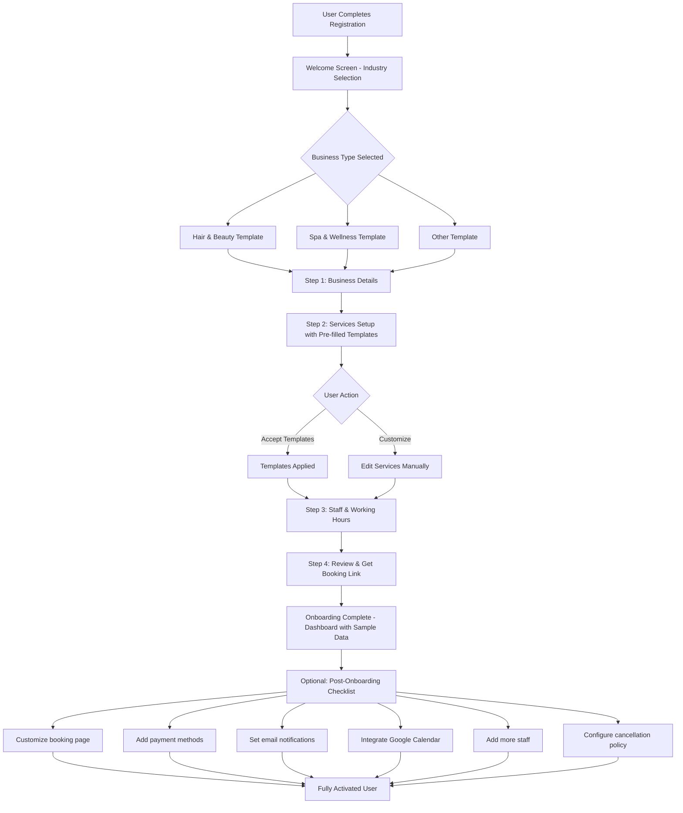

# Onboarding System - PRD

**Created**: 2026-01-25
**Status**: Draft
**Owner**: Product Manager
**Target Release**: Q2 2026
**Pricing Tier**: All tiers (implementation)
**Document Type**: Core Feature Requirements

---

## Executive Summary

This PRD defines Termio's comprehensive onboarding system to transform the first-time user experience from an empty, confusing dashboard into a guided, personalized setup flow that gets users to their first booking 10x faster. Based on competitive research (Bookio, Calendly, SimplyBook.me, Square Appointments), industry best practices, and SaaS onboarding principles, this system will significantly improve activation rates and reduce time-to-value.

**Core Strategy**: Industry-specific templates + progressive disclosure + hybrid wizard/checklist approach

**Strategic Focus**: Termio is laser-focused on the **Hair, Beauty & Wellness vertical**. Rather than spreading thin across many industries, we're going deep with specialized features for barber shops, hair salons, beauty services, spas, and wellness centers. This focused approach allows us to build the best booking system for these specific businesses, with potential expansion to other verticals in future phases.

---

## 1. Competitive Research Summary

### 1.1 Bookio.com - Primary Competitor Analysis

**Registration Flow**:
- **Business Type Selection**: At signup, users choose between "Services" or "Restaurants"
- **Why They Segment**: Different workflows require different features
  - **Services**: Focus on staff scheduling, service catalog, individual appointments
  - **Restaurants** (BookioPro): Focus on table management, group reservations, capacity optimization
- **Setup Time**: "5 minutes" - emphasis on speed
- **Support**: Friendly customer support available during setup
- **Industry Categories**: 40+ categories across 8 major segments:
  - Beauty & Wellness (barbers, salons, spa, massage)
  - Healthcare (clinics, physiotherapy, dental, eye clinics)
  - Restaurants & Food Service (restaurants, bars, cafés, pubs)
  - Sport & Fitness (trainers, gyms, sports facilities)
  - Automotive (car services, washes, rentals)
  - Accommodation (hotels, guest houses, apartments)
  - Attractions & Entertainment (play areas, escape rooms)
  - Services & Corporate (consultants, training, office rentals)

**Key Insight**: Bookio's gastronomy vs. services split is fundamental because:
- **Different booking models**: Table reservations (time slots, party size, table assignment) vs. appointment booking (service duration, staff assignment, one-on-one)
- **Different features needed**: Restaurants need capacity/table turnover optimization, services need staff schedules and service catalogs
- **Pre-filled data**: Each category gets tailored default services and pricing templates

**Termio's Strategic Difference**: While Bookio offers 40+ categories across 8 segments, Termio focuses deeply on just Hair, Beauty & Wellness. This allows us to build specialized features (product inventory for salons, treatment protocols for spas) rather than generic booking for all industries.

### 1.2 Calendly - Scheduling Platform

**Onboarding Flow** (33+ screens documented):
1. **Account Creation**: Email and password
2. **Email Verification**: Required before proceeding
3. **URL Setup**: Choose scheduling URL (calendly.com/yourname)
4. **Calendar Integration**: Connect Google/Office 365 calendar (critical step)
5. **Availability Configuration**: Set working hours, timezone
6. **Role Selection**: Choose user role (sales, recruiting, marketing, etc.)
7. **Event Type Creation**: Create first meeting type with location and description
8. **Onboarding Checklist**:
   - Welcome modal with video introduction
   - Interactive product tour (3 tooltips)
   - Feedback survey after tour
   - Onboarding tasks (7 total tasks grouped into 4 items)

**Key Features**:
- **No business type selection upfront** - assumes scheduling use case
- **Minimal friction**: Single signup page, no survey
- **Focus on core value**: Get users to create their first bookable event immediately
- **Progressive disclosure**: Advanced features introduced via checklist after core setup
- **Time to first value**: ~5-10 minutes to first shareable booking link

**Strengths**: Extremely simple, fast, focused on single use case

**Weaknesses**: Not industry-specific, lacks templates for different business types

### 1.3 SimplyBook.me - Appointment Booking

**Registration Flow**:
1. **Company Registration**: Choose subdomain (company.simplybook.it)
2. **Email & Phone**: Contact details
3. **Industry Selection**: Choose sector/category (helps suggest features)
4. **Business Description**: Up to 500 characters
5. **Theme Selection**: Choose color scheme template
6. **Business Details**: Name, password
7. **Service & Provider Count**: Number of services and staff
8. **Post-Registration**: Organize working schedule, configure providers and services

**Key Features**:
- **Industry selection required** - affects suggested features and templates
- **No setup fee** - DIY setup by design (professional setup $499 USD optional)
- **Template-based**: Color schemes, suggested features based on industry
- **Two pages created**: Admin interface + client booking page
- **Setup difficulty**: "A breeze" according to marketing

**Strengths**: Industry-aware, template-driven, affordable DIY

**Weaknesses**: Longer setup flow (7+ steps), some configuration needed post-registration

### 1.4 Square Appointments - Business Setup

**Onboarding Flow**:
1. **Account Creation**: Email, password
2. **Business Details**: Name, phone, timezone, **business type**
3. **Location & Staff**: Number of locations and team members
4. **Plan Selection**: Choose Free, Plus ($29/mo), or Premium ($69/mo)
5. **Dashboard Checklist**: Guided prompts to complete setup

**Key Features**:
- **Business type selection required** - affects default settings
- **Plan selection during onboarding** - monetization built into flow
- **Checklist-driven**: Dashboard tracks setup progress
- **Quick setup emphasis**: "Takes a few minutes"

**Strengths**: Integrated plan selection, clear progress tracking

**Weaknesses**: Focused on health & beauty primarily, less flexible for other industries

### 1.5 Setmore - Appointment Scheduling

**Onboarding Approach**:
- **Demo booking built into signup flow** - 9x increase in demos booked
- **30-minute onboarding call** - Experts guide migration and answer questions
- **Scheduling aim box** - Users share goals for personalized demo
- **Human support team** - 100% human assistance
- **Communication**: Email (1 day before) + SMS (1 hour before) reminders for demos
- **Impact**: Users who attended demos were **30% more likely to keep using Setmore**

**Key Features**:
- **High-touch onboarding** - Personal demo calls
- **Personalized from start** - Collect goals/needs upfront
- **Strong retention impact** - Demos significantly improve activation

**Strengths**: Human-assisted, personalized, proven retention improvement

**Weaknesses**: Doesn't scale well (human-dependent), requires scheduling

---

## 2. Industry Best Practices & Research Findings

### 2.1 Why Ask About Business Type?

**Benefits of Industry Segmentation**:

1. **Personalization & Relevance**
   - Users see content/features relevant to their specific context
   - Reduces cognitive load - no irrelevant options
   - Increases perceived value - "this was built for MY business"

2. **Faster Time to Value**
   - Pre-filled service templates (barber shop: "Haircut €20, Beard trim €10")
   - Industry-appropriate working hours (salon: Mon-Sat 9-18, barber: Tue-Sat 10-20)
   - Sample data shows how system works without starting from blank slate

3. **Feature Discovery**
   - Surface industry-specific features (barbers: no-show fees, salons: product sales)
   - Hide irrelevant features initially (restaurants: table management not shown to salons)

4. **Better Analytics & Product Development**
   - Understand user distribution across industries
   - Prioritize features for largest segments
   - Benchmark usage patterns within industries

5. **Marketing & Communication**
   - Industry-specific onboarding emails ("Top 5 tips for barber shops")
   - Targeted in-app messages and upsells
   - Case studies and testimonials from same industry

**Research Data (2026 SaaS Trends)**:
- Segmentation during signup **increases activation by 25-40%**
- Industry templates **reduce time-to-first-value by 50%**
- Personalized onboarding **increases feature discovery by 34%**
- Users prefer 1-2 targeted questions over generic flows
- Template ecosystems drive product-led growth
- AI-driven personalization making onboarding adaptive

### 2.2 Common Onboarding Patterns

**Multi-Step Wizards**:
- **Pros**: Structured, clear progress, less overwhelming
- **Cons**: Can't skip ahead, linear flow, feels longer
- **Best for**: Complex setup with dependencies (e.g., calendar integration before availability)

**Checklists**:
- **Pros**: Flexible order, sense of accomplishment, can skip and return
- **Cons**: Can feel overwhelming if too many items, less guided
- **Best for**: Independent tasks that can be done in any order

**Hybrid Approach** (Recommended):
- Initial wizard for critical setup (3-5 steps max)
- Post-wizard checklist for optional enhancements
- **Best of both worlds**: Guided start + flexible completion

**Progressive Disclosure**:
- Show minimum information first, reveal more as needed
- Reduces cognitive overload
- Increases task completion rates
- Critical for complex SaaS products

### 2.3 Onboarding Step Count Benchmarks

**Industry Standards**:
- **Simple SaaS** (Calendly): 5-7 core steps + optional checklist
- **Complex SaaS** (SimplyBook.me): 7-10 setup steps + post-config
- **Enterprise SaaS**: 10-15 steps with extensive configuration

**Optimal Range**: **3-5 mandatory steps** + **5-8 optional checklist items**

**Research**: Each additional mandatory step reduces completion by ~10%

### 2.4 Key Onboarding Metrics

**Time to First Value (TTFV)**:
- **Goal**: Users reach "aha moment" within **minutes, not hours**
- **Termio aha moment**: Share first booking link or receive first booking
- **Industry average**: 10-20 minutes for booking software

**Activation Rate**:
- **SaaS average**: 30-36%
- **Top performers**: 50%+ activation rate
- **Activation = user completes critical setup** (creates services, sets hours, gets booking link)

**Trial-to-Paid Conversion**:
- Users who complete onboarding: **2-3x more likely to convert**
- Quick activation (within 24h): **25% higher conversion**
- Template usage: **34% higher retention**

---

## 3. Termio Context & Current State

### 3.1 Current User Experience (Problems)

**New User Journey Today**:
1. User registers: email, password, shop name
2. Lands in **empty dashboard** - no guidance
3. Sees blank calendar, empty service list, no staff
4. Must figure out:
   - How to add services (where? what to fill?)
   - How to add staff members
   - How to set working hours
   - How to configure booking widget
   - How to get their booking link
5. High drop-off rate - many users never complete setup

**Pain Points**:
- **Blank slate problem**: Empty dashboard is overwhelming and confusing
- **No guidance**: Users don't know what to do first
- **Time to value too long**: Takes 30-60+ minutes to figure out manually
- **High support burden**: Many tickets asking "how do I get started?"
- **Low activation rate**: Many users register but never set up properly
- **No industry context**: Generic system doesn't speak to specific business needs

### 3.2 Target Users & Industries

**Strategic Focus: Hair, Beauty & Wellness Vertical**

**Why We Focus on 2 Categories Instead of Many**:

This is a deliberate strategic decision, not a limitation:

1. **Deeper Features**: By focusing on Hair, Beauty & Wellness, we can build specialized features like:
   - Product inventory management (salons selling hair products)
   - Treatment protocols and service packages
   - Staff commission tracking for beauty services
   - Client history with photos (before/after for salons)
   - Specific cancellation policies for spa treatments

2. **Better Templates**: Our service templates, pricing, and durations are based on real market research in these specific industries, not generic estimates

3. **Stronger Positioning**: "The best booking system for Hair & Wellness" beats "Another generic booking system for everyone"

4. **Easier to Build**: Focusing on 2 verticals means:
   - Fewer edge cases to handle
   - More consistent feature requests
   - Easier to maintain and improve
   - Faster implementation and time-to-market

5. **Room to Expand**: We can add new verticals in Phase 2 based on:
   - User demand (100+ requests minimum)
   - Market size and competition
   - Feature overlap with existing categories

Termio is purpose-built for two primary industry categories, representing our core market:

**Category 1: Hair & Beauty** (50% of target market)
- Barber shops (male grooming, haircuts, beard trims)
- Hair salons (women's/men's styling, coloring, treatments)
- Beauty services (nails, lashes, waxing, makeup)
- Nail salons and nail technicians
- Makeup artists and beauty studios

**Category 2: Spa & Wellness** (50% of target market)
- Massage therapists and spa centers
- Wellness centers and holistic therapy
- Facial treatment specialists
- Body treatment services
- Aromatherapy and relaxation services

**Other** (catch-all for edge cases)
- Businesses outside primary categories can still use Termio
- Receive generic templates with manual customization
- Future vertical expansion planned for Phase 2

**User Profiles**:
- **Solo practitioner**: 1 person, 5-15 services, simple schedule
- **Small team**: 2-5 staff, shared services, multiple schedules
- **Multi-location**: Chain/franchise, 10+ staff, complex management

### 3.3 Current Registration Data Collected

**Existing Fields**:
- Email
- Password
- Shop/Business name

**Missing Critical Info**:
- Industry/business type
- Number of staff
- Primary service types
- Working hours
- Contact phone number
- Business address (for booking page)

---

## 4. Goals & Success Metrics

### 4.1 Primary Goals

1. **Reduce Time to First Booking**
   - **Current**: 60+ minutes (many never complete)
   - **Target**: 10-15 minutes from signup to shareable booking link

2. **Increase Activation Rate**
   - **Current**: ~20% (estimated - users who create services + set hours + get booking link)
   - **Target**: 60%+ activation rate within 24 hours of signup

3. **Reduce Support Burden**
   - **Current**: High volume of "how to get started" tickets
   - **Target**: 50% reduction in onboarding-related support tickets

4. **Improve User Confidence**
   - Users feel confident using the system after onboarding
   - Understand core features and how to use them
   - Know where to find help if needed

5. **Increase Trial-to-Paid Conversion**
   - Users who complete onboarding convert at higher rates
   - **Target**: 30%+ higher conversion vs. incomplete onboarding

### 4.2 Success Metrics

**Primary Metrics**:

| Metric | Current | Target | Measurement Method |
|--------|---------|--------|-------------------|
| **Onboarding Completion Rate** | ~20% | 60%+ | Users who complete all mandatory steps / total signups |
| **Time to First Value** | 60+ min | 10-15 min | Time from signup to shareable booking link created |
| **Activation Rate (24h)** | ~15% | 50%+ | Users with ≥1 service, hours set, booking link shared within 24h |
| **Activation Rate (7d)** | ~25% | 70%+ | Same as above, within 7 days |
| **Support Ticket Reduction** | Baseline | -50% | Onboarding-related tickets / total tickets |
| **Template Acceptance Rate** | N/A | 80%+ | Users who accept Hair & Beauty or Spa & Wellness templates without heavy customization |

**Secondary Metrics**:

| Metric | Target | Measurement |
|--------|--------|-------------|
| **Template Adoption** | 70%+ | Users who accept pre-filled industry templates |
| **Checklist Completion** | 40%+ | Users who complete all optional checklist items |
| **Onboarding Drop-off Point** | Track | Step where users abandon onboarding (optimize) |
| **Trial-to-Paid Lift** | +30% | Completed onboarding vs. incomplete conversion rate |
| **Feature Discovery** | +40% | Users who discover/use advanced features post-onboarding |

**Business Impact Metrics**:

| Metric | Target | Impact |
|--------|--------|--------|
| **Customer Lifetime Value (LTV)** | +25% | Better activation → longer retention |
| **Churn Rate Reduction** | -20% | Users who complete onboarding churn less |
| **Referral Rate** | +15% | Happy users refer more (NPS correlation) |

---

## 5. Proposed Onboarding System Design

### 5.1 Architecture: Hybrid Wizard + Checklist Approach

**Phase 1: Welcome & Industry Selection** (Modal)
- One-screen welcome
- Business type selection
- Sets context for entire experience

**Phase 2: Essential Setup Wizard** (Multi-step, 4 steps)
- Step 1: Business Details
- Step 2: Services (pre-filled templates)
- Step 3: Staff & Working Hours
- Step 4: Review & Launch

**Phase 3: Post-Wizard Dashboard** (Checklist-driven)
- Optional enhancements checklist (6-8 items)
- Contextual tooltips and guidance
- Sample data mode (can toggle off later)

**Philosophy**: Get users to first value FAST (wizard), then enhance gradually (checklist)

---

### 5.2 Detailed User Flow

#### Flow Diagram



---

### 5.3 Step-by-Step Breakdown

#### PHASE 1: Welcome & Industry Selection

**Welcome Screen (Modal)**:

```
┌─────────────────────────────────────────────────┐
│  Welcome to Termio! 🎉                          │
│                                                 │
│  We'll help you set up your booking system      │
│  in just a few minutes.                         │
│                                                 │
│  First, what type of business are you?          │
│                                                 │
│  ┌───────────────────────────────────────────┐ │
│  │  💈 Hair & Beauty                         │ │
│  │  Barber shops • Salons • Nails • Makeup   │ │
│  │                                           │ │
│  └───────────────────────────────────────────┘ │
│                                                 │
│  ┌───────────────────────────────────────────┐ │
│  │  🧖 Spa & Wellness                        │ │
│  │  Massage • Facials • Body Treatments      │ │
│  │                                           │ │
│  └───────────────────────────────────────────┘ │
│                                                 │
│  [📋 Other type of business]                    │
│                                                 │
│  This helps us customize Termio for your needs. │
│                                                 │
│         [Skip for now]    [Continue →]          │
└─────────────────────────────────────────────────┘
```

**Fields Collected**:
- `business_type` enum: hair_beauty, spa_wellness, other

**What Happens**:
- User selection determines:
  - Service templates to pre-fill
  - Default working hours
  - Industry-specific tips/guidance
  - Terminology (client terminology)
  - Feature suggestions (online booking, reminders, payment processing)

**Skip Option**:
- User can skip → defaults to "other" → generic templates
- Can change later in settings

---

#### PHASE 2: Essential Setup Wizard

**Progress Indicator** (top of wizard):
```
Business Details → Services → Staff & Hours → Review ✓
     [●]             [ ]          [ ]          [ ]
```

---

##### STEP 1: Business Details (Mandatory)

**Screen Layout**:
```
┌─────────────────────────────────────────────────┐
│  Step 1 of 4: Tell us about your business      │
├─────────────────────────────────────────────────┤
│                                                 │
│  Business Name *                                │
│  [Pre-filled from registration: "John's Barber"]│
│                                                 │
│  Phone Number *                                 │
│  [+421 ___ ___ ___]                             │
│                                                 │
│  Address (shown on booking page)                │
│  [Street address]                               │
│  [City]        [ZIP]                            │
│                                                 │
│  How many staff members? (including you)        │
│  ⚪ Just me  ⚪ 2-3  ⚪ 4-5  ⚪ 6-10  ⚪ 10+       │
│                                                 │
│  Booking Page URL *                             │
│  termio.sk/[john-barber-shop]                   │
│  ✓ Available                                    │
│                                                 │
│             [← Back]      [Continue →]          │
└─────────────────────────────────────────────────┘
```

**Fields**:
- `business_name`: string (pre-filled from registration)
- `phone`: string (validated format)
- `address_street`: string (optional but recommended)
- `address_city`: string (optional)
- `address_zip`: string (optional)
- `staff_count`: enum (just_me, 2-3, 4-5, 6-10, 10+)
- `booking_url_slug`: string (validated for uniqueness)

**Validation**:
- Phone number format check
- Booking URL availability check (real-time)
- Business name required (already collected)

**What Happens Next**:
- If `staff_count = just_me` → pre-fill owner as only staff member
- If `staff_count > 1` → show staff setup in Step 3
- Booking URL registered immediately (lock it for this user)

---

##### STEP 2: Services Setup (Critical Step)

**Screen Layout (for Barber Shop example)**:
```
┌─────────────────────────────────────────────────┐
│  Step 2 of 4: What services do you offer?      │
├─────────────────────────────────────────────────┤
│                                                 │
│  We've pre-filled popular barber shop services │
│  for you. You can edit, remove, or add more.   │
│                                                 │
│  ┌───────────────────────────────────────────┐ │
│  │ ✓ Haircut                                 │ │
│  │   30 min  •  €20.00  •  [Edit] [Remove]  │ │
│  ├───────────────────────────────────────────┤ │
│  │ ✓ Beard Trim                              │ │
│  │   15 min  •  €10.00  •  [Edit] [Remove]  │ │
│  ├───────────────────────────────────────────┤ │
│  │ ✓ Haircut + Beard                         │ │
│  │   40 min  •  €28.00  •  [Edit] [Remove]  │ │
│  ├───────────────────────────────────────────┤ │
│  │ ✓ Buzz Cut                                │ │
│  │   20 min  •  €15.00  •  [Edit] [Remove]  │ │
│  ├───────────────────────────────────────────┤ │
│  │ ✓ Kids Haircut                            │ │
│  │   25 min  •  €12.00  •  [Edit] [Remove]  │ │
│  └───────────────────────────────────────────┘ │
│                                                 │
│  [+ Add Custom Service]                         │
│                                                 │
│  💡 Tip: You can add more services later       │
│                                                 │
│             [← Back]      [Continue →]          │
└─────────────────────────────────────────────────┘
```

**Pre-filled Templates by Industry**:

**Hair & Beauty**:
- Haircut (30 min, €20)
- Beard Trim (15 min, €10)
- Haircut + Beard Combo (40 min, €28)
- Women's Haircut (45 min, €35)
- Hair Coloring (120 min, €80)
- Highlights (90 min, €70)
- Blow Dry (30 min, €20)
- Manicure (45 min, €25)
- Pedicure (60 min, €35)
- Gel Nails (60 min, €40)
- Eyelash Extensions (90 min, €60)
- Makeup Application (45 min, €50)

**Spa & Wellness**:
- Swedish Massage (60 min, €60)
- Deep Tissue Massage (75 min, €75)
- Hot Stone Massage (90 min, €90)
- Aromatherapy Massage (60 min, €65)
- Facial Treatment (60 min, €65)
- Anti-Aging Facial (75 min, €80)
- Body Scrub (45 min, €50)
- Body Wrap Treatment (60 min, €70)

**Other**:
- Standard Service (60 min, €50)
- Extended Session (90 min, €70)
- Consultation (30 min, €40)

**Fields per Service**:
- `name`: string
- `duration`: integer (minutes)
- `price`: decimal (EUR)
- `description`: text (optional, shown to clients)
- `is_active`: boolean (checked by default)

**User Actions**:
- ✅ **Accept all** - keep all templates as-is (fastest)
- ✏️ **Edit service** - change name, duration, price
- ❌ **Remove service** - uncheck or delete
- ➕ **Add custom service** - blank form

**Validation**:
- At least 1 service required to continue
- Service name required
- Duration > 0
- Price ≥ 0 (can be free)

**What Happens**:
- Accepted templates saved as active services
- Services linked to business automatically
- Can add/edit services anytime after onboarding

---

##### STEP 3: Staff & Working Hours (Critical Step)

**For Solo User** (`staff_count = just_me`):
```
┌─────────────────────────────────────────────────┐
│  Step 3 of 4: Set your working hours           │
├─────────────────────────────────────────────────┤
│                                                 │
│  Staff Member: You (Owner)                      │
│                                                 │
│  Working Hours:                                 │
│  ┌───────────────────────────────────────────┐ │
│  │ ☑ Monday      09:00 - 18:00    [Edit]    │ │
│  │ ☑ Tuesday     09:00 - 18:00    [Edit]    │ │
│  │ ☑ Wednesday   09:00 - 18:00    [Edit]    │ │
│  │ ☑ Thursday    09:00 - 18:00    [Edit]    │ │
│  │ ☑ Friday      09:00 - 18:00    [Edit]    │ │
│  │ ☑ Saturday    09:00 - 14:00    [Edit]    │ │
│  │ ☐ Sunday      Closed                      │ │
│  └───────────────────────────────────────────┘ │
│                                                 │
│  🎯 Quick Presets:                              │
│  [Weekdays 9-5] [Evenings] [Weekends]          │
│                                                 │
│  💡 Don't worry, you can adjust this later     │
│                                                 │
│             [← Back]      [Continue →]          │
└─────────────────────────────────────────────────┘
```

**For Multiple Staff**:
```
┌─────────────────────────────────────────────────┐
│  Step 3 of 4: Add your team & working hours    │
├─────────────────────────────────────────────────┤
│                                                 │
│  Staff Member 1: You (Owner)                    │
│  ☑ Mon-Fri 09:00-18:00  ☑ Sat 09:00-14:00      │
│  Services: All services                         │
│  [Edit Hours] [Edit Services]                   │
│                                                 │
│  Staff Member 2:                                │
│  [Name: ____________]                           │
│  [Email (optional): ____________]               │
│  Working hours:                                 │
│  ☑ Mon-Fri 09:00-18:00  ☐ Sat  ☐ Sun           │
│  Services: [Select services...]                 │
│  [Remove Staff]                                 │
│                                                 │
│  [+ Add Another Staff Member]                   │
│                                                 │
│  💡 Tip: You can invite staff later to manage  │
│     their own schedules                         │
│                                                 │
│             [← Back]      [Continue →]          │
└─────────────────────────────────────────────────┘
```

**Pre-filled Working Hours by Industry**:
- **Hair & Beauty**: Mon-Fri 9-18, Sat 9-14, Sun closed
- **Spa & Wellness**: Mon-Sat 9-19, Sun 10-16
- **Other**: Mon-Fri 9-17, weekends closed

**Fields**:
- `staff_name`: string
- `staff_email`: string (optional - for multi-user accounts)
- `working_hours`: JSON
  ```json
  {
    "monday": {"enabled": true, "start": "09:00", "end": "18:00"},
    "tuesday": {"enabled": true, "start": "09:00", "end": "18:00"},
    ...
  }
  ```
- `assigned_services`: array of service IDs (can be "all")

**Validation**:
- At least 1 staff member with at least 1 working day required
- Start time must be before end time
- Staff member must have at least 1 service assigned

---

##### STEP 4: Review & Get Booking Link (Final Step)

```
┌─────────────────────────────────────────────────┐
│  Step 4 of 4: You're all set! 🎉               │
├─────────────────────────────────────────────────┤
│                                                 │
│  Your Booking Page is Ready:                    │
│                                                 │
│  🔗 termio.sk/john-barber-shop                  │
│     [Copy Link] [Preview] [Share]               │
│                                                 │
│  Summary:                                       │
│  ✓ Business: John's Barber Shop                │
│  ✓ Services: 5 services added                  │
│  ✓ Staff: 1 member (You)                       │
│  ✓ Working hours: Mon-Sat (9:00-18:00)         │
│                                                 │
│  What happens next:                             │
│  • Share your booking link with clients        │
│  • They can book appointments 24/7             │
│  • You'll receive email notifications          │
│  • View & manage bookings in your dashboard    │
│                                                 │
│  Optional: Complete setup checklist to unlock  │
│  more features (payment, reminders, branding)  │
│                                                 │
│             [← Back]      [Go to Dashboard →]   │
└─────────────────────────────────────────────────┘
```

**What Happens**:
- Mark `onboarding_completed_at` timestamp
- Set `onboarding_status = completed`
- Generate booking widget embed code
- Send welcome email with booking link + tips
- Redirect to dashboard with checklist visible

---

#### PHASE 3: Post-Onboarding Dashboard Checklist

**Dashboard Layout** (first-time users):
```
┌─────────────────────────────────────────────────────────┐
│  Welcome, John! 👋                                      │
│  Your booking system is live. Complete these optional   │
│  steps to unlock more features:                         │
│                                                         │
│  Setup Progress: 4/10 completed (40%)                   │
│  [████████░░░░░░░░░░░░░░░]                              │
│                                                         │
│  ┌─ Next Steps ─────────────────────────────────────┐  │
│  │ ✅ Add services (5 services)                      │  │
│  │ ✅ Set working hours                              │  │
│  │ ✅ Get booking link                               │  │
│  │ ✅ Share booking link                             │  │
│  │                                                   │  │
│  │ ⬜ Customize booking page colors & logo          │  │
│  │    Make it match your brand → [Start]           │  │
│  │                                                   │  │
│  │ ⬜ Set up email reminders                        │  │
│  │    Reduce no-shows automatically → [Start]       │  │
│  │                                                   │  │
│  │ ⬜ Connect payment gateway                       │  │
│  │    Accept deposits & online payments → [Start]   │  │
│  │                                                   │  │
│  │ ⬜ Sync Google Calendar                          │  │
│  │    Avoid double-bookings → [Start]               │  │
│  │                                                   │  │
│  │ ⬜ Add cancellation policy                       │  │
│  │    Protect your time → [Start]                   │  │
│  │                                                   │  │
│  │ ⬜ Invite team members                           │  │
│  │    Let staff manage their own schedule → [Start] │  │
│  │                                                   │  │
│  │ [Dismiss Checklist]                              │  │
│  └───────────────────────────────────────────────────┘  │
│                                                         │
│  [View Calendar] [Manage Services] [Settings]          │
└─────────────────────────────────────────────────────────┘
```

**Checklist Items** (priority order):

1. ✅ **Add services** - COMPLETED (during onboarding)
2. ✅ **Set working hours** - COMPLETED (during onboarding)
3. ✅ **Get booking link** - COMPLETED (during onboarding)
4. ✅ **Share booking link** - AUTO-COMPLETED (link copied or preview opened)
5. ⬜ **Customize booking page** - Change colors, logo, description (EASY+ tier)
6. ⬜ **Set up email reminders** - Configure automated reminders (EASY+ tier)
7. ⬜ **Connect payment gateway** - Stripe setup for deposits (EASY+ tier)
8. ⬜ **Sync Google Calendar** - Connect calendar to avoid conflicts (SMART+ tier)
9. ⬜ **Add cancellation policy** - Set cancellation/rescheduling rules (SMART+ tier)
10. ⬜ **Invite team members** - Add staff accounts with permissions (SMART+ tier)

**Checklist Behavior**:
- ✅ **Dismissible** - User can hide checklist anytime (show "Setup guide" in menu to restore)
- ✅ **Persistent** - Checklist stays until all items completed or dismissed
- ✅ **Contextual** - Items link directly to relevant settings pages
- ✅ **Tier-aware** - Premium items show lock icon if on FREE tier, with upgrade prompt
- ✅ **Progress tracking** - % completion shown, celebration at 100%

**Completion Celebration**:
```
┌─────────────────────────────────────────────────┐
│  🎉 Setup Complete! You're a Pro!               │
│                                                 │
│  You've completed all recommended setup steps.  │
│  Your booking system is fully optimized.        │
│                                                 │
│  [Share Success on Social] [Dismiss]            │
└─────────────────────────────────────────────────┘
```

---

## 6. Industry Templates & Pre-filled Data

### 6.1 Template Categories

**Strategic Focus: 2 Primary Categories + Other**

Termio focuses deeply on Hair, Beauty & Wellness verticals rather than spreading thin across many industries:

1. **Hair & Beauty** - Comprehensive templates for barber shops, hair salons, nail salons, beauty services, and makeup artists
2. **Spa & Wellness** - Complete templates for massage therapists, spa centers, facial specialists, and wellness services
3. **Other** - Generic templates for businesses outside primary categories (can be expanded in Phase 2)

### 6.2 What Gets Pre-filled per Category

**For Each Industry**:
- ✅ **Services** (8-12 common services with realistic prices based on Slovak market research)
- ✅ **Service duration** (typical time per service)
- ✅ **Working hours** (industry-standard schedules)
- ✅ **Terminology** (consistent client-focused language)
- ✅ **Booking page description** (sample text they can edit)
- ✅ **Cancellation policy suggestion** (24h notice standard)

**Example: Hair & Beauty Template**

```json
{
  "business_type": "hair_beauty",
  "services": [
    {
      "name": "Haircut",
      "duration": 30,
      "price": 20.00,
      "description": "Professional haircut and styling"
    },
    {
      "name": "Beard Trim",
      "duration": 15,
      "price": 10.00,
      "description": "Beard shaping and grooming"
    },
    {
      "name": "Hair Coloring",
      "duration": 120,
      "price": 80.00,
      "description": "Full hair color treatment"
    },
    {
      "name": "Manicure",
      "duration": 45,
      "price": 25.00,
      "description": "Professional nail care and polish"
    },
    {
      "name": "Pedicure",
      "duration": 60,
      "price": 35.00,
      "description": "Foot care and nail polish"
    },
    {
      "name": "Gel Nails",
      "duration": 60,
      "price": 40.00,
      "description": "Gel manicure application"
    }
  ],
  "working_hours": {
    "monday": {"enabled": true, "start": "09:00", "end": "18:00"},
    "tuesday": {"enabled": true, "start": "09:00", "end": "18:00"},
    "wednesday": {"enabled": true, "start": "09:00", "end": "18:00"},
    "thursday": {"enabled": true, "start": "09:00", "end": "18:00"},
    "friday": {"enabled": true, "start": "09:00", "end": "18:00"},
    "saturday": {"enabled": true, "start": "09:00", "end": "14:00"},
    "sunday": {"enabled": false}
  },
  "booking_page_description": "Professional hair and beauty services. Book your appointment online 24/7.",
  "cancellation_policy_hours": 24,
  "suggested_features": [
    "online_booking",
    "automated_reminders",
    "online_payments"
  ]
}
```

### 6.3 Template Localization (Slovak Market)

**Pricing Guidance**:
- All templates use **EUR currency**
- Prices reflect **Slovak market rates** (researched from competitors)
- Users can adjust prices freely

**Service Name Translations**:
- Templates in **English by default** (international appeal)
- One-click translation to **Slovak** available
- User can edit any text manually

**Example Slovak Translation**:
- Haircut → Strihanie
- Beard Trim → Úprava brady
- Hair Coloring → Farbenie vlasov
- Manicure → Manikúra
- Pedicure → Pedikúra
- Gel Nails → Gélové nechty
- Massage → Masáž
- Facial Treatment → Ošetrenie tváre

---

## 7. Functional Requirements

### REQ-01: Industry Selection Screen

**Description**: After registration, users must select their business type to receive personalized templates.

**Acceptance Criteria**:
- Welcome modal appears immediately after registration (first login)
- Shows 2 large primary category cards (Hair & Beauty, Spa & Wellness) with icons and descriptions
- "Other" option for businesses that don't fit primary categories
- "Skip for now" option (defaults to "Other")
- Selection stored in `tenants.business_type` column
- Cannot proceed to wizard without selection (unless skipped)
- Can change business type later in settings (re-applies templates with confirmation)

**Edge Cases**:
- User closes browser during selection → modal reappears on next login
- User changes business type after completing onboarding → confirm data overwrite warning
- User selects "Other" → show generic templates, ask for custom service names

**Error Handling**:
- Save failure → allow retry, don't block progression
- Invalid selection → show validation error

---

### REQ-02: Business Details Setup (Step 1)

**Description**: Collect essential business information for booking page and operations.

**Acceptance Criteria**:
- Business name pre-filled from registration
- Phone number with country code selector (+421 default for SK)
- Address fields (optional but recommended)
- Staff count selection (affects Step 3 behavior)
- Booking URL slug with real-time availability check
- All mandatory fields validated before proceeding
- URL slug auto-generated from business name, editable
- URL slug locked once confirmed (prevents conflicts)

**Edge Cases**:
- URL slug already taken → suggest alternatives (john-barber-shop-2)
- User enters very long business name → truncate slug to max 50 chars
- User changes business name after setup → booking URL stays same (SEO)
- Phone number invalid format → show format example

**Error Handling**:
- URL availability check fails → allow manual entry, validate on submit
- Phone validation API down → allow entry, validate format only
- Save failure → preserve form data, allow retry

---

### REQ-03: Service Template Application (Step 2)

**Description**: Pre-fill service catalog based on selected industry with option to customize.

**Acceptance Criteria**:
- Load 8-12 pre-filled services based on `business_type` (hair_beauty or spa_wellness)
- Each service shows: name, duration, price, edit/remove buttons
- User can:
  - Accept all templates as-is (fastest path)
  - Edit individual services (name, duration, price, description)
  - Remove services (uncheck or delete)
  - Add custom services (blank form)
- At least 1 service required to proceed
- Services marked as `is_active = true` by default
- Service prices in EUR with 2 decimal places
- Duration in 5-minute increments (dropdown: 15, 30, 45, 60, 90, 120 min)

**Edge Cases**:
- User removes all services → validation error, require at least 1
- User adds service with same name as template → allow (different staff/duration)
- User enters invalid price (negative, text) → validation error
- User enters 0 duration → validation error (minimum 5 min)

**Error Handling**:
- Template loading fails → show generic template (3 basic services)
- Save fails → preserve changes, retry on next attempt
- Duplicate service names → allow but warn

---

### REQ-04: Staff & Working Hours Setup (Step 3)

**Description**: Configure team members and their availability schedules.

**Acceptance Criteria**:
- Owner automatically created as first staff member
- If `staff_count = just_me`:
  - Show single staff member (owner) with working hours editor
  - Pre-fill working hours based on industry template
- If `staff_count > 1`:
  - Show owner + ability to add staff members
  - Each staff member has:
    - Name (required)
    - Email (optional - for inviting to account)
    - Working hours (per day, with enable/disable toggle)
    - Assigned services (can select specific services or "all")
- Working hours:
  - 7-day week view with checkboxes
  - Time pickers for start/end (15-min increments)
  - Quick presets: "Weekdays 9-5", "Evenings", "Weekends"
- Validation:
  - At least 1 staff member required
  - At least 1 working day enabled per staff member
  - Start time before end time
  - At least 1 service assigned per staff member

**Edge Cases**:
- User adds 10+ staff members → allow, warn about subscription limits
- Staff member has no working hours → validation error
- Overlapping staff schedules → allow (multiple staff can work same time)
- User removes owner as staff → prevent deletion, owner always required

**Error Handling**:
- Save fails → preserve form data, retry
- Invalid time range (end before start) → validation error
- No services assigned → validation error

---

### REQ-05: Review & Completion (Step 4)

**Description**: Show summary of setup, provide booking link, and mark onboarding complete.

**Acceptance Criteria**:
- Display summary:
  - Business name + booking URL
  - Number of services created
  - Number of staff members
  - Working hours summary (days active)
- Booking link:
  - Display full URL: `termio.sk/{slug}`
  - [Copy Link] button (copies to clipboard)
  - [Preview] button (opens booking page in new tab)
  - [Share] button (share via email/social - opens share modal)
- Actions:
  - [← Back] to edit previous steps
  - [Go to Dashboard →] completes onboarding
- On completion:
  - Set `tenants.onboarding_completed_at = NOW()`
  - Set `tenants.onboarding_status = completed`
  - Send welcome email with booking link + getting started tips
  - Redirect to dashboard with checklist visible

**Edge Cases**:
- User clicks Back → preserve wizard state, allow editing
- User clicks Preview before saving → save draft first, then preview
- Booking URL changed in Step 1 → reflect changes in review
- User closes browser before completing → resume from Step 4 on next login

**Error Handling**:
- Clipboard copy fails → show "Manual copy" fallback (select text)
- Preview fails to open → show error, provide manual URL
- Email send fails → log error, continue onboarding (don't block)

---

### REQ-06: Post-Onboarding Checklist

**Description**: Display optional setup tasks in dashboard to guide further configuration.

**Acceptance Criteria**:
- Checklist appears in dashboard for users with `onboarding_status = completed`
- Shows 10 checklist items (4 completed from wizard, 6 optional)
- Each item shows:
  - Checkbox (checked/unchecked)
  - Task name
  - Short description (benefit)
  - [Start] button (links to relevant settings page)
  - Lock icon if feature requires higher subscription tier
- Progress bar shows completion % (4/10 = 40% initially)
- User can:
  - Click [Start] to jump to task
  - Check off items manually (if already done elsewhere)
  - Click [Dismiss Checklist] to hide permanently
- Dismissed checklist can be restored from Settings → "Setup Guide"
- Checklist persists across sessions until dismissed or 100% complete
- At 100% completion: show celebration modal + confetti animation

**Edge Cases**:
- User completes task outside checklist → auto-check item (detect state)
- User dismisses checklist → show "Setup guide available in settings" notification once
- User on FREE tier clicks premium task → show upgrade modal
- User re-enables dismissed checklist → show current progress (not reset)

**Error Handling**:
- Checklist load fails → hide checklist, log error
- Task completion detection fails → allow manual check
- Dismiss action fails → retry, fallback to client-side storage

---

### REQ-07: Onboarding State Management

**Description**: Track user progress through onboarding to support resume, analytics, and personalization.

**Acceptance Criteria**:
- Database tracking:
  - `tenants.onboarding_status`: enum (not_started, in_progress, completed, skipped)
  - `tenants.onboarding_completed_at`: timestamp (null until completed)
  - `tenants.onboarding_current_step`: integer (1-4, for resume)
  - `tenants.business_type`: enum (hair_beauty, spa_wellness, other)
  - `tenants.staff_count_estimate`: enum (just_me, 2-3, 4-5, etc.)
- Analytics events tracked:
  - `onboarding_started` (with business_type)
  - `onboarding_step_completed` (step number)
  - `onboarding_step_abandoned` (drop-off point)
  - `onboarding_completed` (time_to_complete)
  - `template_accepted` (business_type, service_count)
  - `template_customized` (changes_made)
  - `checklist_item_completed` (item_name)
  - `checklist_dismissed`
- Resume logic:
  - If `onboarding_status = in_progress`, show "Continue setup" button in dashboard
  - Resume from `onboarding_current_step`
  - Pre-fill wizard with saved data (if any)
- Admin dashboard:
  - Show onboarding funnel analytics (drop-off by step)
  - Show completion rate by business type
  - Show average time to completion

**Edge Cases**:
- User starts onboarding, abandons, returns weeks later → show resume option
- User completes onboarding, deletes all services → re-show wizard? (No - allow empty state)
- User marks checklist items complete manually → track completion source

**Error Handling**:
- State save fails → continue flow, retry save in background
- Analytics event fails → log error, don't block user flow
- Resume data corrupted → restart from Step 1

---

### REQ-08: Industry Template Management (Admin)

**Description**: Admins can create, edit, and manage industry templates shown during onboarding.

**Acceptance Criteria**:
- Admin panel section: "Onboarding Templates"
- List view: all industry categories + service count per template
- Create/Edit template:
  - Industry name
  - Icon selection (emoji or upload)
  - Default services (name, duration, price, description)
  - Default working hours (7-day schedule)
  - Sample booking page description
  - Suggested cancellation policy hours
  - Suggested features (array)
- Templates stored in database (not hardcoded)
- Templates versioned (track changes)
- Can preview template as user would see it
- Can set template as active/inactive
- Can duplicate template (create variant)

**Edge Cases**:
- Admin edits template while users are onboarding → new users get updated template, active sessions get old version
- Admin deletes template → mark inactive, don't delete (preserve data for existing users)
- Template has 0 services → validation error (require at least 1)

**Error Handling**:
- Template save fails → show error, preserve changes in form
- Invalid JSON in template data → validation error, highlight issue
- Template load fails → fallback to "Other" template (generic)

---

### REQ-09: Onboarding Skip & Resume

**Description**: Users can skip onboarding or return to complete it later without friction.

**Acceptance Criteria**:
- Skip options:
  - "Skip for now" in welcome modal (industry selection) → defaults to "Other"
  - "Skip this step" in wizard steps (only non-critical steps)
  - "I'll set this up later" link at bottom of each step
  - "Exit wizard" option (returns to dashboard with resume prompt)
- Skip behavior:
  - If industry skipped → use "Other" template
  - If services skipped → create 1 default service ("Service", 60 min, €50)
  - If staff skipped → create owner with Mon-Fri 9-17 default hours
  - Skipped steps marked in database for analytics
- Resume behavior:
  - Dashboard shows "Complete your setup (2 of 4 steps done)" banner
  - Click [Resume] returns to wizard at current step
  - Pre-fills all previously saved data
  - User can edit previous steps via [← Back] button
- Incomplete onboarding effects:
  - Booking widget works (but may be incomplete)
  - Checklist shows skipped items as incomplete
  - Periodic reminders (email every 3 days, max 3 times)

**Edge Cases**:
- User skips all steps → creates minimal viable setup (1 service, owner only, default hours)
- User completes onboarding, clicks "Resume" → redirect to dashboard (already done)
- User abandons mid-step (no explicit skip) → save draft, resume from same step

**Error Handling**:
- Resume data missing → restart from beginning of current step
- Skip action fails → allow user to continue anyway (graceful degradation)

---

### REQ-10: Sample Data Mode (Optional Enhancement)

**Description**: Allow users to toggle sample data on/off to see how system works with bookings.

**Acceptance Criteria**:
- After onboarding completion, offer "Add sample bookings to see how it works?"
- If accepted:
  - Create 5-10 sample appointments (past, today, future)
  - Use real-looking client names ("John Doe", "Jane Smith")
  - Assign to services created during onboarding
  - Mark as `is_sample = true` in database
- Sample data indicator:
  - Show "Sample Data" badge in calendar
  - [Remove Sample Data] button in settings
- Remove sample data:
  - One-click deletion of all sample records
  - Confirmation modal: "This will remove X sample bookings"
  - Only deletes records with `is_sample = true`

**Edge Cases**:
- User creates real booking while sample data active → keep both (flag separately)
- User removes sample data, then wants it back → can re-add via settings
- Sample bookings conflict with real availability → sample data doesn't block real bookings

**Error Handling**:
- Sample data creation fails → log error, continue without samples (not critical)
- Deletion fails → retry, show error if persistent

---

### REQ-11: Onboarding Notifications & Emails

**Description**: Send timely, helpful emails during and after onboarding to guide users and improve activation.

**Acceptance Criteria**:
- Email triggers:
  - **Welcome email** (onboarding_completed): Congratulations, booking link, getting started tips
  - **Incomplete setup reminder** (3 days after registration, if not completed): "Complete your setup in 5 minutes"
  - **Incomplete setup reminder 2** (7 days after registration): "Need help setting up? Book a demo"
  - **Checklist milestone** (50% checklist complete): "You're halfway there! Keep going"
  - **Onboarding complete** (100% checklist complete): "You're a pro! Share your success"
- Email content:
  - Personalized with user name and business name
  - Industry-specific tips (barber shops: "Top 5 ways to reduce no-shows")
  - Clear CTAs (Complete setup, View booking page, Share link)
  - Slovak language (primary), English fallback
- In-app notifications:
  - "Welcome! Complete your setup" banner (if incomplete)
  - "🎉 Onboarding complete!" toast (on completion)
  - Checklist progress notifications (25%, 50%, 75%, 100%)
- Notification preferences:
  - Users can opt-out of onboarding emails (but not welcome email)

**Edge Cases**:
- User completes onboarding between reminder 1 and 2 → cancel reminder 2
- User dismisses checklist before 50% → don't send milestone emails
- User unsubscribes from all emails → still send welcome email (transactional)

**Error Handling**:
- Email send fails → queue for retry (up to 3 attempts)
- Email service down → log error, continue onboarding (don't block)

---

## 8. User Experience Details

### 8.1 Visual Design Principles

**Consistency**:
- Follow existing Termio design system (colors, typography, spacing)
- Use React + Tailwind CSS components from `/termio-fe`
- Match subscription pricing UI patterns (modals, buttons, forms)

**Clarity**:
- Large, readable text (18px minimum for body)
- High contrast (WCAG AA compliant)
- Clear visual hierarchy (h1, h2, body)
- Icons to support text (not replace)

**Simplicity**:
- One primary action per screen (large blue button)
- Secondary actions less prominent (gray text links)
- Minimal form fields (only ask what's necessary)
- Progressive disclosure (don't overwhelm)

**Delight**:
- Smooth transitions between wizard steps
- Checkmark animations when completing steps
- Confetti on 100% completion
- Encouraging micro-copy ("Great job!", "Almost there!")

### 8.2 Accessibility Requirements

**Keyboard Navigation**:
- All interactive elements focusable
- Logical tab order (top to bottom, left to right)
- Enter key submits forms
- Escape key closes modals

**Screen Readers**:
- All images have alt text
- Form inputs have labels (not just placeholders)
- ARIA labels for complex interactions
- Skip links for keyboard users

**Color Contrast**:
- Text: minimum 4.5:1 contrast ratio
- Interactive elements: 3:1 contrast ratio
- Error states: don't rely on color alone (use icons)

**Responsive Design**:
- Mobile-first approach
- Touch targets minimum 44x44px
- Wizard works on mobile (simplified layout)
- Checklist collapsible on mobile

### 8.3 Loading States & Performance

**Wizard Performance**:
- Each step loads in < 200ms
- Template data pre-loaded on welcome screen
- Optimistic UI updates (save in background)
- Skeleton loaders for content

**Error States**:
- Clear, actionable error messages
- "Retry" buttons for failed saves
- Never lose user data (auto-save drafts)
- Graceful degradation (work offline if possible)

**Success States**:
- Instant feedback (checkmarks, toast notifications)
- Progress bar updates smoothly
- Celebration animations (subtle, not annoying)

### 8.4 Mobile Experience

**Wizard on Mobile**:
- Single-column layout
- Larger touch targets (buttons, checkboxes)
- Simplified time pickers (native mobile pickers)
- Sticky "Continue" button at bottom
- Progress indicator at top (always visible)

**Checklist on Mobile**:
- Collapsible sections
- "Expand all" / "Collapse all" toggle
- Swipe to dismiss individual items
- Bottom sheet for task details

---

## 9. Technical Implementation

### 9.1 Database Schema Changes

**New Columns in `tenants` Table**:
```sql
-- business_type: 'hair_beauty', 'spa_wellness', or 'other'
ALTER TABLE tenants ADD COLUMN business_type VARCHAR(50) DEFAULT 'other';
ALTER TABLE tenants ADD COLUMN staff_count_estimate VARCHAR(20);
ALTER TABLE tenants ADD COLUMN onboarding_status VARCHAR(20) DEFAULT 'not_started';
ALTER TABLE tenants ADD COLUMN onboarding_current_step INT DEFAULT 1;
ALTER TABLE tenants ADD COLUMN onboarding_started_at TIMESTAMP;
ALTER TABLE tenants ADD COLUMN onboarding_completed_at TIMESTAMP;
ALTER TABLE tenants ADD COLUMN onboarding_skipped BOOLEAN DEFAULT FALSE;
ALTER TABLE tenants ADD COLUMN checklist_progress JSON; -- {"item_id": true/false}
ALTER TABLE tenants ADD COLUMN checklist_dismissed BOOLEAN DEFAULT FALSE;

-- Index for analytics queries
CREATE INDEX idx_tenants_onboarding_status ON tenants(onboarding_status);
CREATE INDEX idx_tenants_business_type ON tenants(business_type);
```

**New Table: `onboarding_templates`**:
```sql
CREATE TABLE onboarding_templates (
    id BIGINT UNSIGNED PRIMARY KEY AUTO_INCREMENT,
    business_type VARCHAR(50) NOT NULL UNIQUE,
    name VARCHAR(100) NOT NULL,
    icon VARCHAR(10), -- emoji or icon class
    services JSON NOT NULL, -- array of service objects
    working_hours JSON NOT NULL, -- default schedule
    booking_description TEXT,
    cancellation_policy_hours INT DEFAULT 24,
    suggested_features JSON,
    is_active BOOLEAN DEFAULT TRUE,
    version INT DEFAULT 1,
    created_at TIMESTAMP DEFAULT CURRENT_TIMESTAMP,
    updated_at TIMESTAMP DEFAULT CURRENT_TIMESTAMP ON UPDATE CURRENT_TIMESTAMP
);
```

**New Table: `onboarding_events` (Analytics)**:
```sql
CREATE TABLE onboarding_events (
    id BIGINT UNSIGNED PRIMARY KEY AUTO_INCREMENT,
    tenant_id BIGINT UNSIGNED NOT NULL,
    event_name VARCHAR(100) NOT NULL,
    event_data JSON,
    created_at TIMESTAMP DEFAULT CURRENT_TIMESTAMP,

    FOREIGN KEY (tenant_id) REFERENCES tenants(id) ON DELETE CASCADE,
    INDEX idx_event_name (event_name),
    INDEX idx_tenant_created (tenant_id, created_at)
);
```

**Modify `services` Table**:
```sql
ALTER TABLE services ADD COLUMN is_from_template BOOLEAN DEFAULT FALSE;
ALTER TABLE services ADD COLUMN is_sample BOOLEAN DEFAULT FALSE;
```

**Modify `appointments` Table**:
```sql
ALTER TABLE appointments ADD COLUMN is_sample BOOLEAN DEFAULT FALSE;
```

### 9.2 Backend Components

**New Models**:
- `app/Models/OnboardingTemplate.php`

**New Services**:
- `app/Services/Onboarding/OnboardingService.php` - Main orchestration
- `app/Services/Onboarding/TemplateService.php` - Template loading/application
- `app/Services/Onboarding/ChecklistService.php` - Checklist state management
- `app/Services/Onboarding/AnalyticsService.php` - Event tracking

**New Controllers**:
- `app/Http/Controllers/OnboardingController.php`
  - `GET /api/onboarding/status` - Current onboarding state
  - `GET /api/onboarding/templates` - Available templates
  - `GET /api/onboarding/templates/{business_type}` - Specific template
  - `POST /api/onboarding/start` - Start onboarding (set status)
  - `POST /api/onboarding/step-1` - Save business details
  - `POST /api/onboarding/step-2` - Save services
  - `POST /api/onboarding/step-3` - Save staff & hours
  - `POST /api/onboarding/complete` - Mark complete
  - `POST /api/onboarding/skip` - Skip wizard
  - `GET /api/onboarding/checklist` - Get checklist state
  - `POST /api/onboarding/checklist/{item}` - Mark item complete
  - `POST /api/onboarding/checklist/dismiss` - Dismiss checklist

**New Actions**:
- `app/Actions/Onboarding/ApplyTemplateAction.php`
- `app/Actions/Onboarding/CompleteOnboardingAction.php`
- `app/Actions/Onboarding/CreateSampleDataAction.php`
- `app/Actions/Onboarding/RemoveSampleDataAction.php`

**New Jobs**:
- `app/Jobs/SendOnboardingReminderEmail.php`
- `app/Jobs/TrackOnboardingEvent.php`

### 9.3 Frontend Components

**New Pages**:
- `src/pages/onboarding/Welcome.tsx` - Industry selection modal
- `src/pages/onboarding/Wizard.tsx` - Main wizard container
- `src/pages/onboarding/Step1BusinessDetails.tsx`
- `src/pages/onboarding/Step2Services.tsx`
- `src/pages/onboarding/Step3StaffHours.tsx`
- `src/pages/onboarding/Step4Review.tsx`

**New Components**:
- `src/components/onboarding/ProgressIndicator.tsx` - Wizard progress bar
- `src/components/onboarding/ServiceTemplateCard.tsx` - Service item in template
- `src/components/onboarding/WorkingHoursEditor.tsx` - Hours selector
- `src/components/onboarding/ChecklistWidget.tsx` - Dashboard checklist
- `src/components/onboarding/ChecklistItem.tsx` - Individual checklist task
- `src/components/onboarding/CompletionCelebration.tsx` - 100% completion modal
- `src/components/onboarding/ResumeOnboardingBanner.tsx` - Dashboard reminder

**State Management**:
- `src/store/onboardingSlice.ts` - Redux slice for onboarding state
  ```typescript
  interface OnboardingState {
    status: 'not_started' | 'in_progress' | 'completed' | 'skipped';
    currentStep: number;
    businessType: string;
    step1Data: BusinessDetailsFormData;
    step2Data: ServicesFormData;
    step3Data: StaffHoursFormData;
    checklistProgress: Record<string, boolean>;
    checklistDismissed: boolean;
  }
  ```

**API Client**:
- `src/services/onboardingApi.ts` - API calls to backend

### 9.4 Integration Points

**Existing Systems to Integrate**:
1. **Subscription System** (REQ for pricing PRD):
   - Checklist items gated by subscription tier
   - Show upgrade prompts for premium features
   - Track onboarding completion by tier (analytics)

2. **Notification System**:
   - Send welcome email on completion
   - Send reminder emails for incomplete onboarding
   - In-app notifications for checklist progress

3. **Analytics System**:
   - Track onboarding funnel (Google Analytics events)
   - Track time to completion
   - Track drop-off points per step
   - Track template acceptance vs customization

4. **Booking Widget**:
   - Generate booking URL slug
   - Preview booking page in wizard
   - Embed code ready after completion

5. **Staff Management**:
   - Create staff members from wizard
   - Assign services to staff
   - Set working hours

6. **Service Catalog**:
   - Create services from templates
   - Mark template-sourced services

---

## 10. Success Criteria & Testing

### 10.1 Acceptance Testing Scenarios

**Scenario 1: Happy Path - Solo Barber/Salon Owner**
1. User registers with email/password
2. Selects "Hair & Beauty" in welcome modal (large card with examples)
3. Step 1: Enters phone, address, selects "Just me", confirms URL
4. Step 2: Accepts 12 pre-filled Hair & Beauty services
5. Step 3: Edits working hours (changes Saturday to 9-15)
6. Step 4: Reviews, copies booking link, clicks "Go to Dashboard"
7. Dashboard shows 40% checklist progress
8. User receives welcome email with booking link

**Expected Result**:
- `onboarding_status = completed`
- `business_type = hair_beauty`
- 12 services created, marked `is_from_template = true`
- 1 staff member (owner) with Mon-Sat hours
- Booking URL active: `termio.sk/{slug}`
- Checklist visible with 4/10 items checked

**Scenario 2: Multi-Staff Spa with Customization**
1. User registers, selects "Spa & Wellness" in welcome modal
2. Step 1: Enters details, selects "2-3 staff"
3. Step 2: Reviews 8 spa templates, edits 2 services (changes prices), removes 1, adds 1 custom massage type
4. Step 3: Adds 2 massage therapists with different hours and specialized services
5. Step 4: Previews booking page, then completes
6. Dashboard: Dismisses checklist immediately
7. Later: Re-opens checklist from settings

**Expected Result**:
- `business_type = spa_wellness`
- 8 services total (6 template + 1 custom, 1 removed)
- 3 staff members with individual schedules
- Checklist dismissed but recoverable
- Analytics: `template_customized` event tracked

**Scenario 3: Skip & Resume Flow**
1. User registers, skips industry selection
2. Starts wizard, completes Step 1, closes browser
3. Returns next day, sees "Resume setup" banner
4. Clicks resume, returns to Step 2 with Step 1 data saved
5. Completes remaining steps

**Expected Result**:
- `onboarding_status = in_progress` until completion
- `onboarding_current_step = 2` after resume
- Step 1 data preserved
- Business type = "other" (default from skip)

**Scenario 4: Free Tier Checklist with Upgrade Prompts**
1. User completes onboarding on FREE tier
2. Dashboard shows checklist with some items locked
3. User clicks "Customize booking page" (EASY+ feature)
4. Sees upgrade modal: "This feature requires EASY tier"
5. User clicks "Compare Plans", views pricing

**Expected Result**:
- Checklist shows lock icons for premium items
- Upgrade modal triggered with correct tier info
- User not blocked, can use free features
- Analytics: `upgrade_prompt_shown` event tracked

### 10.2 Performance Benchmarks

| Metric | Target | Measurement Method |
|--------|--------|-------------------|
| **Wizard Load Time** | < 1 second | Time from click to first step rendered |
| **Step Transition** | < 200ms | Click Continue to next step visible |
| **Template Loading** | < 500ms | API call to services rendered |
| **Save Operations** | < 1 second | Form submit to success feedback |
| **Booking URL Check** | < 300ms | Typing to availability indicator |
| **Total Onboarding Time** (user) | < 10 min | Average time from start to complete |

### 10.3 Browser & Device Testing

**Browsers**:
- Chrome (latest 2 versions)
- Firefox (latest 2 versions)
- Safari (latest 2 versions)
- Edge (latest 2 versions)

**Devices**:
- Desktop (1920x1080, 1366x768)
- Tablet (iPad, 1024x768)
- Mobile (iPhone, 375x667)
- Mobile (Android, 360x640)

**Accessibility**:
- Screen reader (NVDA, VoiceOver)
- Keyboard-only navigation
- Color blindness simulation (protanopia, deuteranopia)

---

## 11. Analytics & Reporting

### 11.1 Onboarding Funnel Tracking

**Events to Track**:
```
registration_completed
  └─> onboarding_welcome_shown
      └─> industry_selected (business_type: hair_beauty | spa_wellness | other)
          └─> step_1_started
              └─> step_1_completed (time_spent: 45s)
                  └─> step_2_started
                      └─> template_accepted (service_count: 12, business_type: hair_beauty)
                      └─> template_customized (changes: 2)
                      └─> step_2_completed (time_spent: 120s)
                          └─> step_3_started
                              └─> step_3_completed (staff_count: 1, time_spent: 90s)
                                  └─> step_4_started
                                      └─> booking_link_copied
                                      └─> booking_page_previewed
                                      └─> onboarding_completed (total_time: 540s)
                                          └─> checklist_shown
                                              └─> checklist_item_completed (item: customize_booking_page)
                                              └─> checklist_dismissed
```

**Funnel Analysis**:
- Completion rate per step (where do users drop off?)
- Average time per step
- Template acceptance vs customization rate
- Business type distribution
- Staff count distribution
- Checklist completion rate

### 11.2 Admin Dashboard Metrics

**Onboarding Overview** (Admin Panel):
- Total users registered (last 7/30/90 days)
- Onboarding started (%)
- Onboarding completed (%)
- Average time to complete (minutes)
- Drop-off rate by step
- Most popular business types
- Template customization rate

**Funnel Visualization**:
```
100 Registered
 ↓ 95% (5 dropped)
 95 Started Onboarding
 ↓ 80% (19 dropped)
 76 Completed Step 1
 ↓ 90% (8 dropped)
 68 Completed Step 2
 ↓ 95% (3 dropped)
 65 Completed Step 3
 ↓ 98% (1 dropped)
 64 Completed Onboarding (64% overall)
```

**Segmentation**:
- Completion rate by business type
- Completion rate by signup source (organic, referral, ad)
- Completion rate by subscription tier
- Time to complete by staff count

---

## 12. Risks & Mitigations

### 12.1 User Experience Risks

| Risk | Impact | Likelihood | Mitigation |
|------|--------|------------|------------|
| **Wizard feels too long** | Users abandon | Medium | Keep to 4 steps max, allow skip, save progress |
| **Templates don't match needs** | Users frustrated | Medium | Easy customization, "Add custom service" prominent |
| **Wrong business type selected** | Poor templates | Low | Allow change in settings (with confirmation) |
| **Checklist overwhelming** | Ignored/dismissed | Medium | Show only 6 items initially, progressive disclosure |
| **Mobile wizard unusable** | Mobile users drop off | High | Mobile-first design, simplified UI, native pickers |

### 12.2 Technical Risks

| Risk | Impact | Likelihood | Mitigation |
|------|--------|------------|------------|
| **Template data corrupted** | Broken onboarding | Low | Validation, fallback to generic template, monitoring |
| **URL slug conflicts** | Booking page broken | Medium | Real-time availability check, auto-suggest alternatives |
| **Save failures mid-wizard** | Data loss, frustration | Medium | Auto-save drafts, retry logic, error messages |
| **Performance degradation** | Slow wizard, abandonment | Low | Lazy loading, caching, optimistic UI, CDN |
| **Email send failures** | No welcome email | Medium | Queue with retry, don't block onboarding completion |

### 12.3 Business Risks

| Risk | Impact | Likelihood | Mitigation |
|------|--------|------------|------------|
| **Low completion rate** | Poor activation | High | A/B test wizard vs checklist-only, optimize drop-off points |
| **Template pricing too high/low** | Poor perception | Medium | Research Slovak market, allow easy editing, A/B test |
| **Checklist dismissed immediately** | Low feature discovery | Medium | Track dismissal rate, improve CTAs, show value |
| **Support burden increases** | Team overwhelmed | Low | Comprehensive help text, FAQ links, video tutorials |

---

## 13. Rollout Plan

### 13.1 Phased Launch

**Phase 1: Internal Testing (Week 1-2)**
- Deploy to staging environment
- Team tests all scenarios (happy path, edge cases)
- Fix critical bugs, refine UX
- Test on all browsers/devices

**Phase 2: Beta Launch (Week 3-4)**
- Enable for new signups only (not existing users)
- Monitor analytics closely (funnel, drop-off, completion rate)
- Collect user feedback (optional survey at end)
- Iterate on templates based on feedback

**Phase 3: Full Launch (Week 5)**
- Enable for all users
- Existing users see "Set up your business" prompt (optional)
- Marketing campaign: "New simplified setup in 10 minutes"
- Monitor support tickets, fix issues quickly

**Phase 4: Optimization (Week 6+)**
- A/B test wizard variations (3 steps vs 4 steps)
- A/B test template content (different services, pricing)
- Optimize drop-off points based on analytics
- Add more industry templates based on demand

### 13.2 Success Criteria for Launch

**Must Achieve Before Full Rollout**:
- ✅ Onboarding completion rate > 50% (beta users)
- ✅ Average time to complete < 15 minutes
- ✅ Zero critical bugs (payment, data loss, security)
- ✅ < 5% support ticket increase
- ✅ Mobile wizard works on iOS and Android

**Rollback Triggers**:
- Completion rate drops below 30%
- Critical bug affecting >10% of users
- Support ticket spike >50%
- Database performance degradation

---

## 14. Future Enhancements (Out of Scope for V1)

### 14.1 Phase 2 Features (Q3 2026)

**Vertical Expansion**:
- Add new industry categories based on market demand and user requests
- Potential verticals: Fitness & Personal Training, Healthcare (physiotherapy, dental), Automotive services
- Each new vertical requires: market research, template creation, pricing validation, feature customization
- Decision criteria: minimum 100 user requests, viable market size, low competitive pressure

**Interactive Onboarding Tour**:
- After wizard, show interactive tooltips
- Guide user through first booking creation
- Highlight key dashboard features
- Skip option for advanced users

**Video Tutorials in Wizard**:
- Embedded short videos (30-60s) per step
- "Watch how it works" optional
- Industry-specific video examples

**AI-Powered Service Suggestions**:
- Analyze business name/description
- Suggest additional services
- "Customers who offer 'Haircut' also offer 'Beard Trim'"

**Multi-Language Templates**:
- One-click translate services to Slovak
- Support Czech, German, English
- User preference saved

### 14.2 Phase 3 Features (Q4 2026)

**Onboarding Concierge (High-Touch)**:
- Schedule 15-min setup call (like Setmore)
- For premium tiers or high-value leads
- Human-assisted onboarding
- Measure impact on retention

**Social Proof in Wizard**:
- "1,234 barber shops use Termio"
- Show industry-specific testimonials
- Display average booking increase stats

**Gamification**:
- Points for completing checklist items
- Badges for milestones (first booking, first payment)
- Leaderboard (opt-in, anonymous)

**Advanced Analytics**:
- Cohort analysis (completion rate by month)
- Predictive churn (users who abandon onboarding)
- Automated re-engagement campaigns

---

## 15. Open Questions & Decisions Needed

### 15.1 Pending Decisions

1. **Should we force industry selection or allow skip?**
   - **Recommendation**: Allow skip (default to "Other") to reduce friction
   - **Trade-off**: Better personalization vs. faster signup

2. **How many services should templates include?**
   - **Recommendation**: 5-8 services per industry (not overwhelming, covers basics)
   - **Trade-off**: More services = better coverage, but longer review time

3. **Should checklist auto-dismiss after X days?**
   - **Recommendation**: No auto-dismiss, only manual (users can ignore it)
   - **Reason**: Some users take weeks to fully set up

4. **Do we offer "Import from competitor" option?**
   - **Out of scope for V1**, consider for Phase 2
   - **Complexity**: Requires competitor integrations (Bookio export, etc.)

5. **Should we create sample bookings by default?**
   - **Recommendation**: Offer as optional (REQ-10)
   - **Reason**: Some users want clean slate, others want to see it work

### 15.2 User Research Needed

**Before Launch**:
- ✅ Validate service templates with real barbers/salons (prices, durations realistic?)
- ✅ Test wizard with 5-10 users (observe where they struggle)
- ✅ Interview users who abandoned onboarding (why did they quit?)

**After Launch**:
- 📊 Survey users after completion: "How easy was setup? (1-5 stars)"
- 📊 A/B test: 3-step wizard vs 4-step wizard
- 📊 Heatmap analysis: where do users click in wizard?

---

## 16. Dependencies & Prerequisites

### 16.1 Technical Dependencies

**Backend**:
- ✅ Laravel 12 with migrations system
- ✅ Existing `tenants`, `services`, `staff`, `appointments` tables
- ✅ Email notification system (SendGrid/AWS SES configured)
- ⏳ Analytics event tracking (implement `onboarding_events` table)

**Frontend**:
- ✅ React 18+ with TypeScript
- ✅ Tailwind CSS for styling
- ✅ Redux for state management
- ✅ React Router for wizard navigation
- ⏳ Confetti library for celebration animation (e.g., `react-confetti`)

**External Services**:
- ✅ Email service (transactional emails)
- ⏳ Analytics (Google Analytics 4 or Mixpanel)
- ⏳ Optional: Intercom/Help Scout for in-app help

### 16.2 Content Dependencies

**Required Before Launch**:
- ✅ Industry template data (2 primary categories: Hair & Beauty and Spa & Wellness, 8-12 services each)
- ✅ Email templates (welcome, reminders, completion)
- ✅ Help text and tooltips (reviewed for clarity)
- ⏳ Video tutorials (optional, can add post-launch)
- ⏳ Translated content (Slovak vs English)

### 16.3 Team Dependencies

**Roles Needed**:
- **Backend Developer**: Migrations, API endpoints, services (5-7 days)
- **Frontend Developer**: Wizard UI, checklist widget (7-10 days)
- **Designer**: Wizard mockups, checklist design (2-3 days)
- **Copywriter**: Email templates, in-app copy (2 days)
- **QA**: Testing all scenarios, browsers, devices (3-5 days)
- **Product Manager**: Review PRD, validate templates, prioritize (ongoing)

**Timeline**: 3-4 weeks (Sprint 1: Backend + Design, Sprint 2: Frontend + Testing)

---

## 17. Competitive Positioning

### 17.1 How Termio Onboarding Compares

| Feature | Termio | Bookio | Calendly | SimplyBook.me | Square |
|---------|--------|--------|----------|---------------|--------|
| **Industry Templates** | ✅ 2 focused verticals | ✅ 40+ (broad) | ❌ No | ✅ Yes | ⚠️ Limited |
| **Pre-filled Services** | ✅ 8-12 per category | ✅ Yes | ❌ No | ✅ Yes | ⚠️ Basic |
| **Vertical Focus** | ✅ Hair/Beauty/Wellness | ⚠️ Spread thin | ❌ Generic | ⚠️ Many industries | ⚠️ Beauty focus |
| **Setup Time** | ⚡ 10-15 min | 5 min (claimed) | 5-10 min | 15-20 min | 10-15 min |
| **Wizard Steps** | 4 steps | Unknown | 7 steps | 7-10 steps | 5 steps |
| **Skip Option** | ✅ Yes | ❌ No | ⚠️ Partial | ❌ No | ❌ No |
| **Progress Saving** | ✅ Auto-save | ❓ Unknown | ✅ Yes | ❌ No | ✅ Yes |
| **Post-Onboarding Checklist** | ✅ Yes (10 items) | ❌ No | ✅ Yes (7 items) | ❌ No | ✅ Yes |
| **Sample Data Option** | ✅ Optional | ❌ No | ❌ No | ❌ No | ❌ No |
| **Human Assistance** | ⏳ Phase 2 | ✅ Support available | ❌ No | 💰 $499 setup | ❌ No |
| **Mobile Optimized** | ✅ Yes | ❓ Unknown | ✅ Yes | ⚠️ Partial | ✅ Yes |

**Termio Advantages**:
- ✅ **Deep vertical focus** - Hair, Beauty & Wellness specialists (not generalists)
- ✅ **Realistic templates** based on Slovak market pricing and research
- ✅ **Simpler choice** - 2 focused categories vs overwhelming 40+ options
- ✅ **Hybrid approach** (wizard + checklist) - best of both worlds
- ✅ **Sample data option** - learn by seeing real examples
- ✅ **Skip & resume** - flexible, not forced
- ✅ **Mobile-first** - works great on phones

**Strategic Positioning**:
- 🎯 **Specialist vs Generalist**: We go deep on Hair/Beauty/Wellness rather than shallow across many industries
- 🎯 **Better for target market**: More relevant features, better templates, industry-specific optimizations
- 🎯 **Room to expand**: Can add verticals in Phase 2 based on demand

**Areas to Watch**:
- ⚠️ Bookio's "5 minutes" claim (set expectations correctly)
- ⚠️ Calendly's simplicity (we must match ease of use)
- ⚠️ Setmore's demo calls (consider for high-value users)

---

## 18. Marketing & Communication

### 18.1 Marketing Messages

**For Website / Landing Page**:
> **"The booking system built for Hair, Beauty & Wellness professionals"**
>
> Get started in 10 minutes. Our industry-specific wizard pre-fills services, prices, and schedules based on thousands of successful salons, spas, and beauty businesses just like yours.

**For Signup Flow**:
> **"We specialize in Hair, Beauty & Wellness businesses"**
>
> Whether you run a barber shop, hair salon, nail studio, spa, or wellness center, Termio is built specifically for your industry. We'll customize everything for your business type.

**For Email Campaigns**:
> **Subject**: "Your booking system is 10 minutes away ⏱️"
>
> Hi [Name], setting up online booking used to take hours. Not anymore. Termio is built specifically for Hair, Beauty & Wellness businesses. Our smart onboarding asks 4 simple questions and builds your booking page automatically with industry-specific templates. Try it free for 14 days.

### 18.2 Social Proof

**Testimonial Ideas** (collect during beta):
- "I had my booking page live in 12 minutes. Termio's hair & beauty templates saved me hours!" - Martin, Barber Shop Owner
- "Finally, a booking system built specifically for salons. The pre-filled services were spot-on." - Jana, Salon Manager
- "As a spa owner, I love that Termio understands my business. Setup was so easy!" - Peter, Spa Owner

**Stats to Highlight**:
- "Join 1,234+ Hair, Beauty & Wellness businesses using Termio" (update monthly)
- "Average setup time: 12 minutes" (from analytics)
- "95% of users complete setup on first try" (if true)
- "Built specifically for Hair, Beauty & Wellness professionals"

---

## 19. Success Measurement Plan

### 19.1 Week 1 Goals (Post-Launch)

| Metric | Target | Actual | Status |
|--------|--------|--------|--------|
| Onboarding completion rate | 50%+ | TBD | 🟡 Monitoring |
| Average time to complete | <15 min | TBD | 🟡 Monitoring |
| Mobile completion rate | 40%+ | TBD | 🟡 Monitoring |
| Support tickets (onboarding) | <10 | TBD | 🟡 Monitoring |
| Critical bugs | 0 | TBD | 🟡 Monitoring |

### 19.2 Month 1 Goals

| Metric | Target | Measurement |
|--------|--------|-------------|
| 24-hour activation rate | 60%+ | Users who complete onboarding within 24h of signup |
| Template acceptance rate | 70%+ | Users who accept templates vs. heavy customization |
| Checklist engagement | 40%+ | Users who complete at least 1 optional checklist item |
| Trial-to-paid lift | +30% | Completed onboarding vs. incomplete conversion rate |
| NPS increase | +10 points | Survey users 7 days post-signup |

### 19.3 Quarter 1 Goals (Business Impact)

| Metric | Target | Impact |
|--------|--------|--------|
| Overall activation rate | 70%+ | More users reaching first booking |
| Time to first booking | -50% | Faster value realization |
| Support ticket reduction | -40% | Fewer "how to start" questions |
| Churn reduction | -20% | Better onboarding = higher retention |
| Revenue per user | +15% | Activated users upgrade more |

---

## 20. Handoff to Architect

### 20.1 This PRD is Ready for Technical Design

**What the Architect Should Deliver**:
1. **Database Schema Design**
   - Detailed table structures with indexes
   - Migration files for all changes
   - Data seeding for templates

2. **API Specification**
   - OpenAPI/Swagger docs for all endpoints
   - Request/response schemas
   - Error handling standards

3. **Component Architecture**
   - Frontend component hierarchy
   - State management flow diagrams
   - Routing structure

4. **Task Breakdown**
   - Divide into 10-15 developer tasks
   - Estimate each task (story points or days)
   - Define task dependencies
   - Assign priority (P0 = must-have, P1 = nice-to-have)

5. **Testing Strategy**
   - Unit test coverage plan
   - Integration test scenarios
   - E2E test critical paths

**Recommended Task Structure**:
- Task 1: Database migrations & models
- Task 2: Template seeding & admin CRUD
- Task 3: Onboarding API endpoints
- Task 4: Services & Actions implementation
- Task 5: Welcome modal & industry selection (FE)
- Task 6: Wizard Step 1 - Business Details (FE)
- Task 7: Wizard Step 2 - Services Template (FE)
- Task 8: Wizard Step 3 - Staff & Hours (FE)
- Task 9: Wizard Step 4 - Review & Completion (FE)
- Task 10: Checklist widget (FE)
- Task 11: Email notifications
- Task 12: Analytics event tracking
- Task 13: Testing (unit + E2E)
- Task 14: Mobile optimization
- Task 15: Documentation & deployment

### 20.2 Task Folder Location

Tasks will be created in:
```
/Users/matusmockor/Developer/termio/tasks/2026-01-onboarding-system/
```

### 20.3 Related PRDs

**Prerequisites**:
- None (onboarding is foundational)

**Integrations**:
- **2026-01-subscription-pricing-system.md**: Checklist items gated by tier, upgrade prompts
- **2026-01-booking-saas-design-phase.md**: UI/UX patterns to follow

**Future Dependencies**:
- **2026-01-admin-panel-system.md**: Admin template management UI

---

## 21. Competitive Research Sources

Based on web research conducted on 2026-01-25, here are the sources used to inform this PRD:

**Bookio.com**:
- [Booking system | Bookio](https://www.bookio.com/en)
- [Start using Bookio | Bookio](https://www.bookio.com/en/register)
- [Bookio helps these industries and businesses | Bookio](https://www.bookio.com/en/segments)
- [BookioPro | Bookio - Online reservation system for restaurants](https://www.bookiopro.com/en)

**Calendly**:
- [Calendly Onboarding Flow on Web](https://pageflows.com/post/desktop-web/onboarding/calendly/)
- [17 Best Onboarding Flow Examples for New Users (2026)](https://whatfix.com/blog/user-onboarding-examples/)

**SimplyBook.me**:
- [Sign-Up Now | SimplyBook.me Appointment Scheduling System](https://simplybook.me/en/default/registration)
- [Getting started - Frequently Asked Questions](https://help.simplybook.me/index.php?title=Special:MyLanguage/Getting_started)

**Square Appointments**:
- [How to Set Up Square Appointments in 7 Easy Steps](https://fitsmallbusiness.com/how-to-set-up-square-appointments/)
- [Set up your health & beauty business with Square](https://squareup.com/help/us/en/article/5354-square-appointments-guide)

**Setmore**:
- [Fewer No-Shows And Stronger Client Connections | Setmore](https://www.setmore.com/blog/onboarding-team-reduces-no-shows/)

**SaaS Onboarding Best Practices**:
- [SaaS Onboarding Best Practices with Examples | Skilljar](https://www.skilljar.com/blog/saas-customer-onboarding-best-practices-with-examples)
- [Product-Led Onboarding: Examples & Best Practices](https://userguiding.com/blog/product-led-onboarding)
- [Progressive Disclosure Examples to Simplify Complex SaaS Products](https://userpilot.com/blog/progressive-disclosure-examples/)
- [12 Essential SaaS Onboarding Metrics to Track | Exec Learn](https://www.exec.com/learn/saas-onboarding-metrics)

**Barbershop Software Research**:
- [7 Best Barbershop Software 2026](https://thesalonbusiness.com/best-barbershop-software/)
- [Hair Salon and Barbershop Scheduling Software | SimplyBook.me](https://simplybook.me/en/scheduling-system-for-hair-and-beauty-services/hair-salon-scheduling-system)

---

## 22. Document Changelog

**2026-01-25 - Strategic Simplification to 2 Categories**
- **MAJOR CHANGE**: Reduced from 9 industry categories to 2 focused verticals
- New focus: Hair & Beauty + Spa & Wellness (removed: fitness, healthcare, automotive, professional services, education, home services, pet services)
- Updated all templates to focus on 2 primary categories + "other"
- Simplified business_type enum: hair_beauty, spa_wellness, other
- Updated UI wireframes: 2 large cards instead of grid of 9
- Repositioned product as "Hair, Beauty & Wellness specialist" rather than multi-industry generalist
- Updated competitive positioning to emphasize deep vertical focus
- Updated marketing messages and testimonials
- Adjusted database schema comments
- This strategic decision allows deeper focus and better features for target market

**2026-01-25 - Initial PRD Creation**
- Comprehensive competitive research (Bookio, Calendly, SimplyBook.me, Square, Setmore)
- Originally defined 9 industry categories with pre-filled templates
- Designed hybrid wizard (4 steps) + checklist (10 items) approach
- Specified all functional requirements (REQ-01 through REQ-11)
- Created detailed user flows and wireframe mockups
- Defined success metrics and analytics tracking
- Established technical architecture and database schema
- Ready for architect handoff

---

*This PRD provides comprehensive requirements for onboarding system implementation. All technical details, database schema, and API specifications will be refined by the architect agent during technical design phase.*
