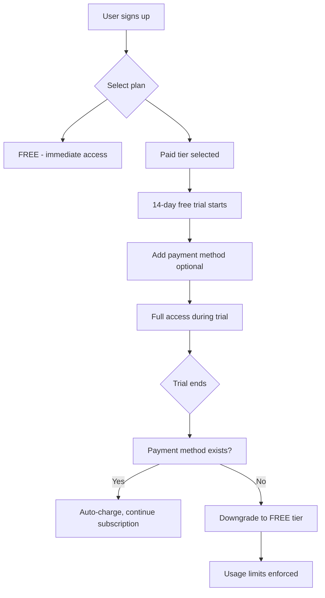
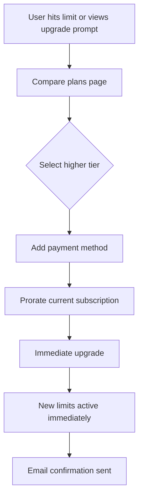
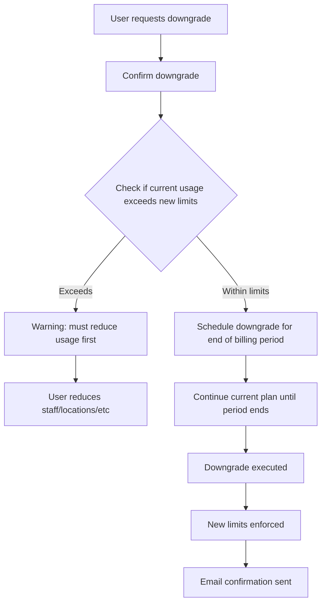
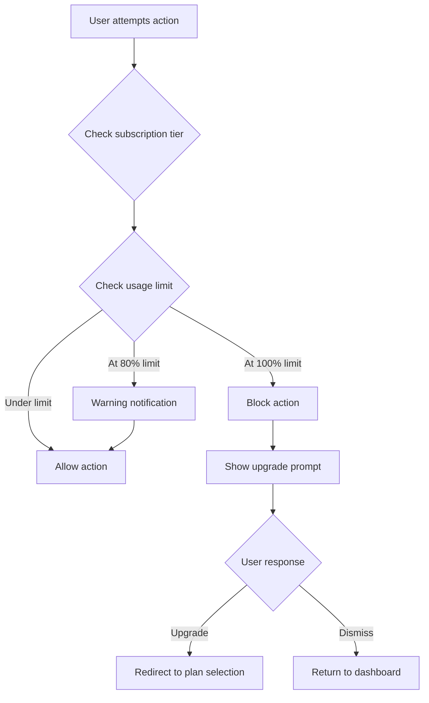

# Subscription Pricing System - PRD

**Created**: 2026-01-23
**Status**: Draft
**Owner**: Product Manager
**Target Release**: Q2 2026
**Pricing Tier**: All tiers (implementation)
**Document Type**: Core Feature Requirements

---

## 1. Goal

Implement a flexible, multi-tier subscription pricing system for Termio that **beats Bookio on price and value** - enabling business owners to get more features for less money. The system must support both monthly and yearly billing with aggressive discounts, free trials, and seamless plan transitions.

### Competitive Strategy: "More for Less"
- **40-45% cheaper** than Bookio across all paid tiers
- **More features at lower tiers** (Google Calendar, payments in EASY vs SMART)
- **Higher yearly discounts** (31-33% vs 22%)
- **SMS credits included** (not extra charge)
- **Transparent pricing** (no hidden "contact us" for PREMIUM)

---

## 2. Target Audience

### Primary Users

**Small Business Owners (Solo Practitioners)**
- Profile: Hair stylists, massage therapists, personal trainers, beauticians
- Current state: Testing the platform or using free tier
- Need: Affordable entry-level pricing with room to grow
- Price sensitivity: High (will churn if too expensive)
- Expected tier: FREE -> EASY -> SMART

**Small Team Businesses (2-5 staff)**
- Profile: Small salons, clinics, fitness studios
- Current state: Outgrowing free/basic tier
- Need: Multi-user support, more reservations
- Price sensitivity: Moderate (willing to pay for value)
- Expected tier: SMART -> STANDARD

**Multi-Location Businesses (Enterprise)**
- Profile: Salon chains, fitness franchises, clinic networks
- Current state: Evaluating platform or on STANDARD tier
- Need: Unlimited resources, white-label, priority support
- Price sensitivity: Low (focus on features and support)
- Expected tier: PREMIUM (custom pricing)

### Market Context
- **Competition**: Bookio.com, SimplyBook.me, Calendly, Acuity Scheduling
- **Competitive Strategy**: Undercut Bookio by 20-30% while offering more generous limits
- **Market**: Slovakia primary, Czech Republic secondary
- **Currency**: EUR only (initial phase)

---

## 3. Problem

### Current State
- No subscription system exists
- All features available to everyone (unsustainable)
- No revenue stream
- No way to limit usage or enforce business model
- Cannot differentiate value for different customer segments

### Pain Points
- **Business risk**: Cannot monetize the platform
- **No growth path**: Users cannot upgrade for more features
- **Resource waste**: Heavy users consume resources without paying
- **Support burden**: All users expect equal support regardless of value

### Competition Analysis

**Bookio.com pricing (benchmark)**:
- FREE: EUR 0/month, 100 reservations, 1 user
- EASY: EUR 6.90/month (yearly), 200 reservations, 1 user
- SMART: EUR 14.90/month (yearly), 1000 reservations, 2 users
- STANDARD: EUR 29.90/month (yearly), unlimited, 5 users
- PREMIUM: Custom pricing, unlimited everything

**Our competitive advantage - BEAT BOOKIO**:
- **20-30% cheaper prices** across all tiers
- **More generous limits** (2-3x more reservations, more users)
- **More features at lower tiers** (Google Calendar sync in EASY, not SMART)
- Better upgrade prompts integrated into UX
- Slovak-first pricing and communication
- **Goal**: Become the "better value" choice in Slovakia

### Impact of Inaction
- Cannot sustain business without revenue
- Unlimited free usage prevents paid conversions
- No ability to fund development and support
- Platform remains MVP quality indefinitely

---

## 4. Subscription Tiers

### Tier Structure (COMPETITIVE - Beats Bookio)

| Tier | Price (Monthly) | Price (Yearly) | Discount | Reservations/Month | Users | vs Bookio |
|------|----------------|----------------|----------|-------------------|-------|-----------|
| **FREE** | EUR 0 | EUR 0 | - | **150** | 1 | +50% more reservations |
| **EASY** | **EUR 5.90** | EUR 49 (EUR 4.09/month) | **31%** | **350** | 1 | **-41% cheaper**, +75% more reservations |
| **SMART** | **EUR 11.90** | EUR 99 (EUR 8.25/month) | **31%** | **1,500** | **3** | **-45% cheaper**, +50% more reservations, +1 user |
| **STANDARD** | **EUR 24.90** | EUR 199 (EUR 16.58/month) | **33%** | Unlimited | **10** | **-45% cheaper**, +5 users |
| **PREMIUM** | **EUR 49.90** | EUR 449 (EUR 37.42/month) | **25%** | Unlimited | Unlimited | Fixed pricing (Bookio = custom/hidden) |

**Price & limits comparison vs Bookio:**
| Tier | Termio Price | Bookio Price | Savings | Termio Rez. | Bookio Rez. | More |
|------|--------------|--------------|---------|-------------|-------------|------|
| FREE | EUR 0 | EUR 0 | - | 150 | 100 | +50% |
| EASY | EUR 4.09/mo | EUR 6.90/mo | **-41%** | 350 | 200 | +75% |
| SMART | EUR 8.25/mo | EUR 14.90/mo | **-45%** | 1,500 | 1,000 | +50% |
| STANDARD | EUR 16.58/mo | EUR 29.90/mo | **-45%** | ∞ | ∞ | - |

### Feature Matrix (MORE VALUE than Bookio)

| Feature | FREE | EASY | SMART | STANDARD | PREMIUM |
|---------|------|------|-------|----------|---------|
| **Core Booking** | | | | | |
| Online booking widget | Yes | Yes | Yes | Yes | Yes |
| Manual reservation creation | Yes | Yes | Yes | Yes | Yes |
| Calendar view | Basic | **Advanced** | Advanced | Advanced | Advanced |
| Client database | Yes | Yes | **Advanced** | Advanced | Advanced |
| Service catalog | Up to 10 | **Unlimited** | Unlimited | Unlimited | Unlimited |
| **Notifications** | | | | | |
| Email confirmations | Yes | Yes | Yes | Yes | Yes |
| Email reminders | **Yes** | Yes | Yes | Yes | Yes |
| SMS reminders | Add-on | Add-on | **50/month** | **200/month** | Unlimited |
| **Customization** | | | | | |
| Custom logo | No | Yes | Yes | Yes | Yes |
| Custom colors | No | Yes | Yes | Yes | Yes |
| Custom booking page URL | No | **Yes** | Yes | Yes | Yes |
| Custom domain | No | No | **Yes** | Yes | Yes |
| White-label (remove branding) | No | No | No | No | Yes |
| **Integrations** | | | | | |
| Google Calendar sync | No | **Yes** | Yes | Yes | Yes |
| Payment gateway | No | **Yes** | Yes | Yes | Yes |
| API access | No | No | **Yes** | Yes | Yes |
| Zapier integration | No | No | Yes | Yes | Yes |
| **Advanced Features** | | | | | |
| Multi-language booking | No | **Yes** | Yes | Yes | Yes |
| Staff permissions | No | No | Yes | Yes | Yes |
| Client segmentation | No | No | **Yes** | Yes | Yes |
| Waitlist management | No | No | Yes | Yes | Yes |
| Recurring appointments | No | **Yes** | Yes | Yes | Yes |
| Gift vouchers | No | No | **Yes** | Yes | Yes |
| Reports & Statistics | Basic | **Full** | Full | Full | Full |
| **Limits** | | | | | |
| Reservations/month | **150** | **350** | **1,500** | Unlimited | Unlimited |
| Users (staff) | 1 | 1 | **3** | **10** | Unlimited |
| Locations | 1 | 1 | **2** | **10** | Unlimited |
| Services | 10 | Unlimited | Unlimited | Unlimited | Unlimited |
| **Support** | | | | | |
| Email support | Community | Standard | **Priority** | Priority | Dedicated manager |
| Response time | 48h | 24h | **12h** | 4h | 1h |
| Onboarding call | No | No | **Yes** | Yes | Yes |
| Live chat | No | No | Yes | Yes | Yes |

**Key differences vs Bookio (features at LOWER tiers):**
- ✅ Email reminders FREE (Bookio: paid only)
- ✅ Google Calendar sync in EASY (Bookio: SMART)
- ✅ Payment gateway in EASY (Bookio: SMART)
- ✅ Multi-language in EASY (Bookio: SMART)
- ✅ Recurring appointments in EASY (Bookio: SMART)
- ✅ Custom domain in SMART (Bookio: STANDARD)
- ✅ SMS credits INCLUDED in SMART/STANDARD (Bookio: always extra)
- ✅ 50-75% more reservations at every tier

---

## 5. User Flow

### 5.1 New User Registration Flow

### 5.2 Plan Upgrade Flow

### 5.3 Plan Downgrade Flow

### 5.4 Usage Limit Enforcement Flow

---

## 6. Functional Requirements

### REQ-01: Subscription Plan Management (Admin)

**Description**: System administrators must be able to define and manage subscription plans with pricing, features, and limits.

**Acceptance Criteria**:
- Admin can create new subscription plans with:
  - Name (FREE, EASY, SMART, STANDARD, PREMIUM)
  - Monthly price (EUR)
  - Yearly price (EUR)
  - Feature flags (boolean for each feature)
  - Usage limits (reservations/month, users, locations, services)
- Admin can activate/deactivate plans
- Admin can modify pricing (affects new subscriptions only)
- Changes to limits affect all users on that plan immediately
- Historical plan data preserved for reporting

**Edge Cases**:
- Modifying an active plan shows warning about impact
- Cannot delete a plan with active subscribers
- Price changes only apply to new subscriptions or renewals

**Error Handling**:
- Validation prevents negative prices or limits
- Validation requires at least one free plan to exist

---

### REQ-02: User Subscription Selection

**Description**: During registration, users must select a subscription plan and optionally start a free trial.

**Acceptance Criteria**:
- Registration flow shows all available plans
- Plan comparison table highlights recommended tier (SMART)
- FREE tier allows immediate access without payment
- Paid tiers start 14-day free trial automatically
- User can skip payment method during trial
- Trial countdown visible in dashboard
- Email sent 3 days before trial ends
- Email sent 1 day before trial ends

**Edge Cases**:
- User closes browser during plan selection - returns to same step
- User selects PREMIUM tier - redirected to contact sales form
- User has existing account - cannot start new trial

**Error Handling**:
- If payment gateway down, allow trial start without payment method
- If email service down, queue reminder emails

---

### REQ-03: Payment Method Management

**Description**: Users must be able to add, update, and remove payment methods for subscription billing.

**Acceptance Criteria**:
- User can add credit/debit card via Stripe
- Card details stored securely in Stripe (PCI compliance)
- Only last 4 digits shown in UI
- User can update payment method
- User can remove payment method (if no active paid subscription)
- Failed payment attempt sends email notification
- After 3 failed payment attempts, subscription downgraded to FREE

**Edge Cases**:
- Card expires during subscription - email notification 1 month before
- Payment method removed while on paid tier - grace period of 7 days
- User updates card during grace period - reactivate subscription

**Error Handling**:
- Stripe API failure - retry payment up to 3 times over 7 days
- Card declined - email user immediately with retry instructions
- Network timeout - queue payment retry

---

### REQ-04: Recurring Billing Automation

**Description**: System automatically charges users on their billing cycle and handles subscription renewals.

**Acceptance Criteria**:
- Monthly subscriptions charged on same date each month
- Yearly subscriptions charged on anniversary date
- Automatic discount applied for yearly billing (22-26% off)
- Successful payment sends receipt email
- Failed payment triggers retry logic (3 attempts over 7 days)
- After final failed attempt, downgrade to FREE tier
- Invoices generated and stored for each payment
- Invoices accessible in user dashboard

**Edge Cases**:
- Billing date is 29/30/31 and month has fewer days - charge on last day
- User upgrades mid-cycle - prorate charges immediately
- User downgrades mid-cycle - apply at end of current period
- User cancels mid-cycle - access continues until period ends

**Error Handling**:
- Payment gateway timeout - retry within 1 hour
- Duplicate payment detected - refund immediately and log incident
- Currency conversion issue - use ECB rates, notify user if rate changed significantly

---

### REQ-05: Usage Limit Enforcement

**Description**: System must track usage and enforce limits based on user's subscription tier.

**Acceptance Criteria**:
- Track reservations created per month (reset on 1st of each month)
- Track active users (staff members)
- Track active locations
- Track active services
- When user attempts action that exceeds limit:
  - Block action immediately
  - Show clear error message explaining limit
  - Offer upgrade button directly in error modal
- When user reaches 80% of limit:
  - Show warning notification
  - Suggest upgrade to higher tier
- When user reaches 100% of limit:
  - Send email notification
  - Show dashboard banner with upgrade CTA

**Edge Cases**:
- User creates reservation at 99/100 limit - allow (don't block at exact limit)
- User is upgraded mid-month - limits update immediately, usage counter continues
- User downgrades - usage from current month carries over, may exceed new limit
- User exceeds limit after downgrade - restrict new creation but allow existing

**Error Handling**:
- Usage counter inconsistency - recalculate from database, log discrepancy
- Limit check fails - allow action but log error for manual review
- Race condition (concurrent requests) - use database locks

---

### REQ-06: Plan Upgrade

**Description**: Users can upgrade their subscription at any time with immediate effect.

**Acceptance Criteria**:
- User can view plan comparison from dashboard
- User can select higher tier plan
- System calculates prorated charge:
  - Credit for unused days on current plan
  - Charge for remaining days on new plan
- User confirms upgrade and payment
- Upgrade takes effect immediately
- New limits and features active within 1 minute
- Confirmation email sent with new plan details
- Invoice generated showing proration calculation

**Edge Cases**:
- User upgrades from FREE - no proration, full charge
- User upgrades on last day of billing cycle - minimal charge
- User upgrades from yearly to monthly - complex proration
- Payment fails during upgrade - remain on current plan

**Error Handling**:
- Payment gateway failure - roll back upgrade, notify user
- Proration calculation error - log error, allow upgrade without proration
- Feature flag update fails - retry 3 times, notify support team

---

### REQ-07: Plan Downgrade

**Description**: Users can downgrade their subscription with changes taking effect at end of current billing period.

**Acceptance Criteria**:
- User can request downgrade from dashboard
- System checks if current usage exceeds new tier limits:
  - If exceeds users limit: show list of users to deactivate
  - If exceeds locations limit: show list of locations to deactivate
  - If exceeds services limit: show list of services to deactivate
  - If exceeds reservations: warn that future creation limited
- User cannot complete downgrade until usage within new limits
- Once usage compliant, downgrade scheduled for end of billing period
- User retains current features until period ends
- Confirmation email sent with effective date
- Email reminder sent 3 days before downgrade takes effect
- On effective date, downgrade executed and new limits enforced

**Edge Cases**:
- User downgrades on last day of period - immediate effect
- User cancels downgrade before effective date - remains on current plan
- User upgrades before scheduled downgrade - cancel downgrade, execute upgrade
- User deletes account before downgrade - cancel downgrade

**Error Handling**:
- Downgrade scheduled but not executed on date - retry hourly for 24 hours
- Usage check fails - prevent downgrade until check succeeds
- Email notification fails - log error, continue downgrade

---

### REQ-08: Subscription Cancellation

**Description**: Users can cancel their subscription with access continuing until end of current billing period.

**Acceptance Criteria**:
- User can cancel subscription from settings
- Cancellation requires confirmation modal:
  - Show what user will lose
  - Show date when access ends
  - Offer optional feedback form (why canceling)
- Upon cancellation:
  - Scheduled for end of current billing period
  - No future charges
  - Access continues until period ends
  - Confirmation email sent
- Email reminder sent 3 days before access ends
- On end date:
  - Downgrade to FREE tier
  - Enforce FREE tier limits
  - Archive data exceeding limits (not deleted)
- User can reactivate subscription before end date:
  - Cancel the cancellation
  - Resume normal billing

**Edge Cases**:
- User cancels and immediately tries to create reservation beyond FREE limit - allow until end date
- User cancels on last day of period - immediate downgrade
- User cancels during trial - immediate access termination, no charge
- User reactivates after end date - start new billing period immediately

**Error Handling**:
- Cancellation scheduling fails - retry, log error
- Downgrade automation fails - queue for manual processing
- Email notification fails - retry 3 times

---

### REQ-09: Subscription Status Dashboard

**Description**: Users must see clear subscription status, usage, and billing information in their dashboard.

**Acceptance Criteria**:
- Dashboard shows:
  - Current plan name with badge
  - Billing cycle (monthly/yearly)
  - Next billing date and amount
  - Usage metrics for current month:
    - Reservations: X / limit (with progress bar)
    - Users: X / limit
    - Locations: X / limit
  - Payment method (last 4 digits)
  - Upgrade/downgrade buttons
- Separate billing page shows:
  - Billing history (all invoices)
  - Downloadable PDF invoices
  - Update payment method button
  - Cancel subscription button
- Upgrade prompts appear contextually:
  - When creating user beyond limit
  - When creating location beyond limit
  - When reaching 80% reservation limit
  - In settings when feature unavailable for tier

**Edge Cases**:
- Trial period - show "Trial ends in X days" prominently
- Cancelled subscription - show "Access ends on DATE" banner
- Scheduled downgrade - show "Downgrade to PLAN on DATE" notice
- Failed payment - show "Payment failed - update payment method" alert

**Error Handling**:
- Usage data loading failure - show cached data, mark as potentially stale
- Stripe data loading failure - show "Unable to load billing info" message
- Invoice download failure - retry 3 times, then show error

---

### REQ-10: Invoicing and Receipts

**Description**: System must generate compliant invoices for all subscription charges.

**Acceptance Criteria**:
- Each successful payment generates invoice with:
  - Sequential invoice number (INV-YYYY-MM-NNNN)
  - Issue date
  - Company details (Termio SaaS provider info)
  - Customer details (business name, address, VAT ID if provided)
  - Line items:
    - Subscription plan name
    - Billing period (dates)
    - Amount (net)
    - VAT rate (20% for SK)
    - VAT amount
    - Total (gross)
  - Payment method (Card ending XXXX)
  - Invoice status (paid)
- Invoice sent via email immediately after payment
- Invoice downloadable as PDF from dashboard
- Invoices stored permanently
- Support credit notes for refunds
- VAT handling per EU regulations:
  - Slovak customers: show 20% VAT
  - EU customers with valid VAT ID: reverse charge (0% VAT with note)
  - EU customers without VAT ID: show Slovak 20% VAT
  - Non-EU customers: 0% VAT

**Edge Cases**:
- Upgrade proration invoice - show credit and charge as separate lines
- Refund - generate credit note referencing original invoice
- Failed payment - do not generate invoice
- Trial conversion - first invoice explicitly states "Trial conversion"

**Error Handling**:
- Invoice generation failure - retry 3 times, queue for manual generation
- Email delivery failure - retry, allow download from dashboard
- PDF generation failure - provide HTML version, log error

---

### REQ-11: Free Trial Management

**Description**: New users on paid plans receive 14-day free trial with full feature access.

**Acceptance Criteria**:
- Trial automatically starts when user selects paid plan during registration
- Trial provides full access to selected tier features
- Trial countdown visible in dashboard header
- Email reminders sent:
  - Day 11: "3 days remaining in trial"
  - Day 13: "1 day remaining in trial"
  - Day 14: "Trial ended" (if no payment method)
- On trial end:
  - If payment method exists: attempt charge, continue subscription
  - If no payment method: downgrade to FREE tier immediately
  - If payment fails: retry logic (REQ-04)
- User can add payment method anytime during trial
- User can cancel during trial without charge
- One trial per user (tracked by email and business)

**Edge Cases**:
- User signs up again with different email - detect by business name/phone, prevent second trial
- User changes plan during trial - trial continues with new plan features
- User downgrades to FREE during trial - trial cancelled, immediate FREE access

**Error Handling**:
- Trial expiration job fails - retry hourly until success
- Email reminders fail - log error, continue trial logic
- Payment charge at trial end fails - execute retry logic

---

### REQ-12: Feature Gating

**Description**: System must enable/disable features based on user's subscription tier with clear upgrade prompts.

**Acceptance Criteria**:
- Backend:
  - All feature checks use centralized SubscriptionService
  - API endpoints check feature access before processing
  - Return 403 with upgrade message if feature unavailable
- Frontend:
  - Features unavailable in current tier shown as:
    - Grayed out with lock icon
    - Tooltip explaining feature requires upgrade
    - Click opens upgrade modal
  - Upgrade modal shows:
    - Current vs required tier comparison
    - Feature list comparison
    - Pricing
    - "Upgrade Now" button
- Features to gate:
  - Custom logo (EASY+)
  - Email reminders (EASY+)
  - Google Calendar sync (SMART+)
  - Multi-language (SMART+)
  - Multiple locations (STANDARD+)
  - Client segmentation (STANDARD+)
  - API access (STANDARD+)
  - White-label (PREMIUM)

**Edge Cases**:
- User downgrades and has features from higher tier active (e.g., 3 locations on EASY) - disable features gracefully, archive data
- Feature flag changes while user active - refresh feature access on next request
- User upgrades during feature access attempt - allow immediately

**Error Handling**:
- Feature check fails - fail open for FREE tier features, fail closed for paid features
- Upgrade modal fails to load - show simple "Upgrade required" message with link

---

### REQ-13: Yearly Subscription Discount

**Description**: Users selecting yearly billing receive automatic discount (25-33% depending on tier) - MORE AGGRESSIVE than Bookio's 22%.

**Acceptance Criteria**:
- Plan selection shows both monthly and yearly pricing
- Yearly pricing displays discount badge (e.g., "Save 31%")
- Discount calculated as: (monthly_price * 12 - yearly_price) / (monthly_price * 12) * 100
- Discount percentages:
  - EASY: 31% (EUR 70.80 -> EUR 49)
  - SMART: 31% (EUR 142.80 -> EUR 99)
  - STANDARD: 33% (EUR 298.80 -> EUR 199)
  - PREMIUM: 25% (EUR 598.80 -> EUR 449)
- Toggle button allows switching between monthly/yearly view
- Yearly subscriptions charged once per year
- Invoice clearly shows annual discount applied

**Edge Cases**:
- User switches from monthly to yearly mid-cycle - prorate remaining monthly days, charge yearly
- User switches from yearly to monthly mid-year - complex proration, offer to keep yearly until end
- Discount percentages change - only apply to new subscriptions

**Error Handling**:
- Discount calculation error - log error, default to full yearly price
- Billing cycle change fails - keep current cycle, notify support

---

### REQ-14: Proration Calculation

**Description**: When users upgrade or change billing cycle mid-period, calculate fair prorated charges.

**Acceptance Criteria**:
- Upgrade proration formula:
  - Credit = (old_plan_price / days_in_period) * days_remaining
  - New charge = (new_plan_price / days_in_period) * days_remaining
  - Total charge = new_charge - credit
- Downgrade proration (end of period):
  - No refund for unused time
  - User keeps current plan until period ends
- Billing cycle change (monthly to yearly):
  - Credit remaining monthly days
  - Charge full yearly price
  - New anniversary date = date of change
- Display proration breakdown before confirmation:
  - "Credit for current plan: -EUR X.XX"
  - "Charge for new plan: +EUR X.XX"
  - "Total due today: EUR X.XX"

**Edge Cases**:
- Proration results in negative charge (credit exceeds new charge) - apply as credit to next billing
- Same-day upgrade - charge difference with 1-day proration
- Upgrade on last hour of billing period - minimal proration

**Error Handling**:
- Proration calculation error - log error, charge full new plan price, issue manual credit
- Days calculation error - use conservative estimate (favor customer)

---

### REQ-15: VAT Handling for EU Compliance

**Description**: System must correctly calculate and apply VAT based on customer location per EU regulations.

**Acceptance Criteria**:
- Collect customer data:
  - Country (required for all)
  - VAT ID (optional, validated for EU businesses)
- VAT logic:
  - **Slovakia**: Apply 20% VAT always
  - **EU with valid VAT ID**: Reverse charge, 0% VAT, note on invoice "Reverse charge - VAT to be paid by customer"
  - **EU without VAT ID**: Apply Slovak 20% VAT
  - **Non-EU**: 0% VAT
- VAT ID validation via VIES API before accepting
- Invoice shows:
  - Net amount
  - VAT rate
  - VAT amount
  - Gross amount
- Store VAT details for each transaction
- Generate VAT reports for accounting (admin)

**Edge Cases**:
- VIES API down during checkout - accept VAT ID, validate async, adjust invoice if invalid
- Customer changes country after registration - recalculate VAT for next billing
- VAT rate changes - apply to new billing periods only

**Error Handling**:
- VIES validation fails - retry 3 times, if still failing, treat as no VAT ID
- VAT calculation error - default to 20% VAT, log error for review
- Invoice VAT mismatch detected - generate corrective invoice

---

## 7. Notification Requirements

### Subscription Lifecycle Emails

| Event | Trigger | Content | Timing |
|-------|---------|---------|--------|
| Trial Started | User registers with paid plan | Welcome, trial details, feature highlights | Immediate |
| Trial Reminder 1 | Trial day 11 | 3 days remaining, add payment method CTA | 9:00 AM |
| Trial Reminder 2 | Trial day 13 | 1 day remaining, urgent payment method CTA | 9:00 AM |
| Trial Ended (No Payment) | Trial day 14, no payment method | Downgraded to FREE, upgrade CTA | 9:00 AM |
| Trial Converted | First successful charge after trial | Thank you, receipt, next billing date | Immediate |
| Payment Success | Every successful charge | Receipt, invoice attached | Immediate |
| Payment Failed | Payment declined | Update payment method, retry schedule | Immediate |
| Payment Retry Failed (Final) | 3rd failed attempt | Downgraded to FREE, reactivation instructions | Immediate |
| Card Expiring Soon | 30 days before card expiry | Update payment method | 9:00 AM |
| Upgrade Completed | User upgrades plan | Confirmation, new features, invoice | Immediate |
| Downgrade Scheduled | User requests downgrade | Confirmation, effective date, feature loss warning | Immediate |
| Downgrade Reminder | 3 days before downgrade | Reminder, cancel downgrade option | 9:00 AM |
| Downgrade Executed | Downgrade effective date | Confirmation, new plan details | 9:00 AM |
| Cancellation Scheduled | User cancels subscription | Confirmation, access end date | Immediate |
| Cancellation Reminder | 3 days before access ends | Reminder, reactivation option | 9:00 AM |
| Subscription Ended | Access end date reached | Access ended, reactivation CTA | 9:00 AM |
| Usage Limit 80% | User reaches 80% of limit | Warning, usage details, upgrade CTA | Immediate |
| Usage Limit 100% | User reaches 100% of limit | Limit reached, upgrade required | Immediate |

### In-App Notifications

| Event | Location | Message | Action |
|-------|----------|---------|--------|
| Trial ending soon | Dashboard banner | "Your trial ends in X days" | Add payment method |
| Payment failed | Dashboard banner (urgent) | "Payment failed - update payment method" | Update payment |
| Usage at 80% | Dashboard notification bell | "You've used 80% of your monthly reservations" | View usage or upgrade |
| Usage at 100% | Modal on action attempt | "Reservation limit reached for this month" | Upgrade now |
| Feature unavailable | Tooltip on feature | "Available in SMART tier and above" | Compare plans |
| Downgrade scheduled | Dashboard banner | "Downgrade to PLAN on DATE" | Cancel downgrade |

---

## 8. System Impact

### Modified Components

**New Backend Components**:
- `app/Models/Subscription.php` - subscription records
- `app/Models/Plan.php` - plan definitions
- `app/Models/Invoice.php` - invoice records
- `app/Models/PaymentMethod.php` - stored payment methods
- `app/Services/SubscriptionService.php` - subscription logic
- `app/Services/BillingService.php` - billing and invoicing
- `app/Services/UsageLimitService.php` - usage tracking and enforcement
- `app/Services/PlanUpgradeService.php` - upgrade/downgrade logic
- `app/Services/VatService.php` - VAT calculation
- `app/Http/Controllers/SubscriptionController.php` - subscription endpoints
- `app/Http/Controllers/BillingController.php` - billing endpoints
- `app/Jobs/ProcessSubscriptionRenewal.php` - recurring billing
- `app/Jobs/ProcessTrialExpiration.php` - trial end handling
- `app/Jobs/ProcessScheduledDowngrade.php` - scheduled downgrades
- `app/Jobs/RetryFailedPayment.php` - payment retry logic

**Modified Backend Components**:
- `app/Http/Requests/Booking/CreateBookingRequest.php` - add usage limit check
- `app/Http/Controllers/StaffController.php` - add user limit check
- `app/Http/Controllers/LocationController.php` - add location limit check
- `app/Http/Controllers/ServiceController.php` - add service limit check
- All feature controllers - add feature gate checks

**New Frontend Components**:
- `src/pages/subscription/PlanSelection.tsx` - plan comparison and selection
- `src/pages/subscription/SubscriptionDashboard.tsx` - subscription status
- `src/pages/billing/BillingPage.tsx` - billing history and invoices
- `src/pages/billing/PaymentMethodForm.tsx` - add/update payment method
- `src/components/subscription/UsageMetrics.tsx` - usage display
- `src/components/subscription/UpgradeModal.tsx` - upgrade prompts
- `src/components/subscription/PlanBadge.tsx` - plan display badge
- `src/components/subscription/FeatureGate.tsx` - feature gating wrapper

**Modified Frontend Components**:
- `src/components/dashboard/DashboardHeader.tsx` - add trial countdown and subscription status
- All feature-gated components - wrap with FeatureGate

### Integrations

**Stripe (Payment Processing)**:
- Laravel Cashier integration
- Subscription management
- Payment intent creation
- Webhook handling (payment success, failure, dispute)
- Invoice generation
- Card storage (PCI compliant)

**VIES API (VAT Validation)**:
- EU VAT ID validation
- Real-time validation during checkout
- Fallback for API downtime

**Email Service (Transactional)**:
- Subscription lifecycle emails
- Invoice delivery
- Payment notifications

### Database Schema (High-Level)

**New Tables**:
- `plans`: id, name, slug, monthly_price, yearly_price, features (JSON), limits (JSON), is_active
- `subscriptions`: id, tenant_id, plan_id, status, billing_cycle, trial_ends_at, current_period_start, current_period_end, stripe_subscription_id
- `invoices`: id, subscription_id, invoice_number, amount_net, vat_rate, vat_amount, amount_gross, status, stripe_invoice_id, pdf_path
- `payment_methods`: id, tenant_id, stripe_payment_method_id, card_brand, card_last4, expires_at, is_default
- `usage_records`: id, tenant_id, period (YYYY-MM), reservations_count, updated_at

**Modified Tables**:
- `tenants`: add subscription_id foreign key

---

## 9. Success Metrics

### Primary Metrics

| Metric | Target | Measurement |
|--------|--------|-------------|
| Trial-to-paid conversion | 25% | (paid subscriptions / trials started) * 100 |
| FREE-to-paid conversion | 15% | (users who upgrade from FREE / total FREE users) * 100 |
| Monthly Recurring Revenue (MRR) | EUR 10,000 (Month 6) | Sum of all monthly subscription values |
| Annual Recurring Revenue (ARR) | EUR 120,000 (Year 1) | MRR * 12 |
| Average Revenue Per User (ARPU) | EUR 20/month | Total MRR / active paid users |
| Yearly billing adoption | 40% | (yearly subscriptions / total paid subscriptions) * 100 |

### Secondary Metrics

| Metric | Target | Measurement |
|--------|--------|-------------|
| Churn rate (monthly) | Less than 5% | (cancelled subscriptions / total subscriptions) * 100 |
| Upgrade rate | 20% per year | (users who upgraded / total paid users) * 100 |
| Payment failure rate | Less than 3% | (failed payments / total payment attempts) * 100 |
| Support tickets related to billing | Less than 10% | (billing tickets / total tickets) * 100 |
| Time to first upgrade | Less than 60 days | Average days from FREE signup to first paid subscription |

### Business Metrics

| Metric | Target | Measurement |
|--------|--------|-------------|
| Customer Lifetime Value (LTV) | EUR 600 | ARPU * average customer lifetime (months) |
| Customer Acquisition Cost (CAC) | EUR 150 | Total marketing spend / new customers |
| LTV:CAC Ratio | 4:1 | LTV / CAC |
| Payback Period | 7 months | CAC / ARPU |
| Net Revenue Retention (NRR) | 110% | ((starting MRR + expansion - downgrades - churn) / starting MRR) * 100 |

---

## 10. Scope

### In Scope

**Phase 1 (MVP - Q2 2026)**:
- 5 subscription tiers (FREE, EASY, SMART, STANDARD, PREMIUM)
- Monthly and yearly billing with automatic discounts
- 14-day free trial for paid plans
- Stripe integration via Laravel Cashier
- Basic usage limit enforcement (reservations, users, locations)
- Feature gating for major features
- Plan upgrade with proration
- Plan downgrade (end of period)
- Subscription cancellation
- Basic invoicing
- Email notifications for subscription events
- Subscription dashboard (user view)
- Plan comparison page
- Payment method management

**Phase 2 (Enhancements - Q3 2026)**:
- Advanced usage analytics dashboard
- Custom plan creation (PREMIUM tier)
- Team member usage breakdown
- SMS credit add-ons (pay-as-you-go)
- Affiliate/referral program
- Annual plan reminder and renewal
- Dunning management (smart payment retry)
- Subscription pause feature
- Gift subscription codes

**Phase 3 (Enterprise - Q4 2026)**:
- SSO for enterprise customers
- Custom contract terms
- Multi-currency support (CZK)
- Purchase orders and invoicing
- Dedicated account manager assignment
- White-label deployment options
- API rate limiting per tier
- Advanced reporting for enterprise

### Out of Scope (Future Consideration)

- Cryptocurrency payments
- Lifetime subscriptions
- Free trial extensions
- Usage-based pricing (pay per booking)
- Reseller/agency plans
- Non-profit discounts
- Student discounts
- Multiple payment methods per tenant
- Auto-downgrade warnings for inactivity
- Churn prediction ML model

### Dependencies

- Stripe account setup and API keys
- Laravel Cashier package (v15.x)
- PDF generation library for invoices (DomPDF or similar)
- Email service configured (SendGrid, AWS SES)
- VIES API access for VAT validation
- Legal review of terms of service and refund policy
- Accounting software integration planning (Fakturoid, etc.)

---

## 11. Implementation Handoff

### Architect Handoff

This PRD is ready for handoff to the architect agent (`local/architect`) to create detailed technical specifications and break down into implementation tasks.

**Recommended task breakdown**:
1. Database schema design and migrations
2. Stripe integration and Laravel Cashier setup
3. Subscription model and service layer
4. Usage tracking and limit enforcement
5. Billing and invoicing automation
6. Plan upgrade/downgrade logic
7. Frontend plan selection and comparison
8. Frontend subscription dashboard
9. Payment method management UI
10. Feature gating implementation
11. Email notification system
12. Testing (unit and feature tests)
13. Admin panel for plan management

### Task Folder

Tasks will be created in: `/Users/matusmockor/Developer/termio/tasks/2026-01-subscription-pricing-system/`

### Related PRDs

- **2026-01-booking-saas-design-phase.md**: UI/UX design patterns to follow
- **2026-01-booking-anti-spam-protection.md**: Rate limiting integration with subscription tiers
- **Future**: Payment gateway integration PRD (if expanded beyond Stripe)

---

## 12. Agent Session Log

### Session 2026-01-23 (Update 2)

**Status**: Reservation limits optimized based on PM analysis

**Changes made:**
- EASY: 500 → **350** reservations/month (+75% vs Bookio)
- SMART: 2,000 → **1,500** reservations/month (+50% vs Bookio)
- Reason: Better upgrade conversion while staying competitive
- Impact: +€5,200/year per 1,000 customers vs previous limits

---

### Session 2026-01-23 (Initial)

**Status**: Initial PRD creation completed

**Context gathered**:
- Analyzed existing PRDs (design phase, anti-spam protection)
- Reviewed Bookio.com pricing research (5-tier structure, EUR pricing, discounts)
- Confirmed Slovak market focus with EUR currency
- Identified target audience (solo practitioners to multi-location businesses)
- Established competitive positioning vs. Bookio, SimplyBook.me, Calendly

**Pending questions**:
1. Stripe account setup - will this be under Termio company or individual business accounts?
2. VAT registration status - is Termio registered for VAT in Slovakia?
3. Legal requirements - has terms of service been reviewed by lawyer for subscription terms?
4. Refund policy - what is the refund policy for subscriptions (typically no refunds for SaaS)?
5. PREMIUM tier custom pricing - what is the sales process and who handles enterprise deals?
6. SMS credit pricing - separate from subscription or bundled in higher tiers?
7. Payment gateway backup - should we support multiple gateways or Stripe-only?
8. Multi-currency timeline - when do we need CZK support for Czech expansion?

**Working notes**:
- **COMPETITIVE STRATEGY**: Undercut Bookio by 40-45% on price while offering MORE features at each tier
- Moved premium features to lower tiers (Google Calendar, payments, multi-language → EASY)
- Included SMS credits in SMART/STANDARD (Bookio charges separately)
- More aggressive yearly discounts (31-33% vs Bookio's 22%)
- Transparent PREMIUM pricing (€49.90 vs Bookio's hidden "contact us")
- Goal: Win on VALUE - same or better features for significantly less money
- Designed for Slovak market first (language, VAT, currency)
- Proration logic is complex - needs careful testing
- Feature gating must be seamless and not frustrate users
- Upgrade prompts should be contextual, not spammy
- Trial-to-paid conversion critical for revenue success

**Next steps**:
1. User validation - confirm pricing acceptable for Slovak market (user research or competitor analysis)
2. Legal review - terms of service, refund policy, VAT compliance
3. Stripe account setup and API key acquisition
4. Architect handoff - create technical specs and task breakdown
5. Design review - ensure subscription UI/UX follows design phase PRD patterns
6. Backend implementation - database schema, models, services
7. Frontend implementation - plan selection, dashboard, billing pages
8. Testing - comprehensive tests for billing edge cases
9. Soft launch - internal testing with test accounts
10. Public launch - phased rollout starting with new users

**Decisions made**:
- 5-tier structure (FREE, EASY, SMART, STANDARD, PREMIUM) confirmed
- **AGGRESSIVE PRICING**: 40-45% cheaper than Bookio across all tiers
- **MORE FEATURES AT LOWER TIERS**: Google Calendar, payments, multi-language in EASY (Bookio: SMART)
- **SMS INCLUDED**: 50/month in SMART, 200/month in STANDARD (Bookio: extra charge)
- **HIGHER YEARLY DISCOUNTS**: 31-33% vs Bookio's 22%
- Stripe as primary payment gateway (Laravel Cashier)
- 14-day free trial standard for all paid plans
- Proration for upgrades, no refunds for downgrades
- Usage limits reset monthly (calendar month)
- Feature gating with clear upgrade prompts
- VAT handling per EU regulations
- Invoice generation for all payments
- Email notifications for all subscription events

**Technical decisions**:
- Laravel Cashier v15.x for Stripe integration
- Subscription status stored in database, synced with Stripe
- Usage tracking via monthly counter table (reset on 1st)
- Feature gates use centralized SubscriptionService
- Scheduled jobs for trial expiration, billing, downgrades
- Webhook handling for Stripe events (payment success/failure)
- PDF invoices generated and stored in S3/storage

**Design decisions**:
- Plan comparison uses table layout (inspired by Bookio, Calendly)
- Subscription status prominently displayed in dashboard header
- Usage metrics shown with progress bars
- Upgrade prompts use modals (not redirect)
- Feature gates show lock icon with tooltip
- Trial countdown in header (days remaining)

**Risk considerations**:
- Payment gateway downtime - implement retry logic and grace periods
- VAT regulation changes - monitor and update logic
- Proration calculation errors - favor customer, manual correction
- False limit enforcement - fail open for critical features
- Stripe API rate limiting - implement caching and queuing
- Churn risk - monitor and implement retention strategies
- Support load - billing issues can generate high support volume

---

## 13. Competitive Positioning Summary

### Why Termio wins over Bookio:

| Aspect | Termio | Bookio | Winner |
|--------|--------|--------|--------|
| **EASY tier price** | €4.09/mo (yearly) | €6.90/mo | Termio (-41%) |
| **SMART tier price** | €8.25/mo (yearly) | €14.90/mo | Termio (-45%) |
| **STANDARD tier price** | €16.58/mo (yearly) | €29.90/mo | Termio (-45%) |
| **FREE reservations** | 150/month | 100/month | Termio (+50%) |
| **EASY reservations** | 350/month | 200/month | Termio (+75%) |
| **SMART reservations** | 1,500/month | 1,000/month | Termio (+50%) |
| **Google Calendar** | EASY tier | SMART tier | Termio (lower tier) |
| **Payment gateway** | EASY tier | SMART tier | Termio (lower tier) |
| **Multi-language** | EASY tier | SMART tier | Termio (lower tier) |
| **SMS credits** | Included | Extra charge | Termio |
| **Yearly discount** | 31-33% | 22% | Termio |
| **PREMIUM pricing** | Transparent €49.90 | Hidden/custom | Termio |

### Marketing message:
> **"Všetko čo ponúka Bookio, ale o 40% lacnejšie a s 50-75% viac rezervácií v každom balíku."**

---

## 14. Questions for User Validation

Before proceeding to implementation, validate these assumptions:

1. **Aggressive pricing**: Is €4.09/month (EASY yearly) sustainable? Consider costs and margins.

2. **Free tier**: Is 150 reservations/month right balance? (More generous than Bookio's 100)

3. **Trial length**: Keep 14 days or go longer (21/30 days) to differentiate further?

4. **SMS credits included**: Is bundling 50-200 SMS/month in SMART/STANDARD sustainable or should it remain pay-as-you-go?

5. **PREMIUM fixed price**: Is €49.90/month too low for enterprise? Consider raising to €79.90 or keeping custom.

6. **Feature unbundling**: Are we giving away too much at lower tiers? (Google Calendar, payments in EASY)

7. **Refund policy**: Standard no-refund or offer 30-day money-back guarantee to reduce risk perception?

8. **Payment methods**: Stripe only or add alternatives (PayPal, bank transfer) for those without cards?

---

*This PRD provides comprehensive requirements for subscription pricing system implementation. All technical details, database schema, and API specifications will be defined by the architect agent during technical design phase.*
